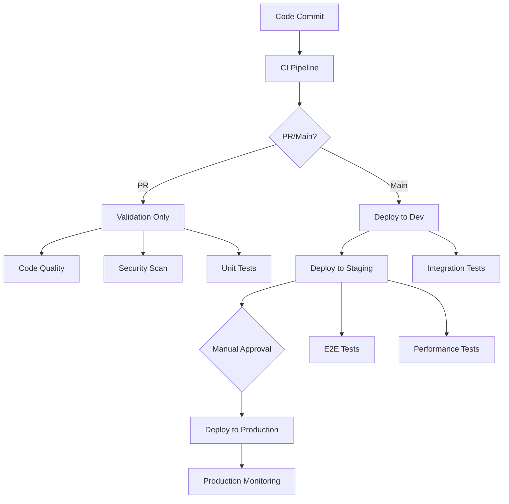

# Clinical Trial Platform - CI/CD Strategy

## Overview

This document outlines the comprehensive CI/CD strategy for the Clinical Trial Data Collection Platform, including deployment workflows, security validation, and rollback procedures. Our strategy ensures secure, compliant, and reliable deployment of healthcare applications while maintaining HIPAA compliance and operational excellence.

## Table of Contents

- [CI/CD Architecture](#cicd-architecture)
- [Pipeline Stages](#pipeline-stages)
- [Environment Strategy](#environment-strategy)
- [Deployment Strategies](#deployment-strategies)
- [Security Integration](#security-integration)
- [Quality Gates](#quality-gates)
- [Rollback Procedures](#rollback-procedures)
- [Monitoring and Alerting](#monitoring-and-alerting)
- [HIPAA Compliance](#hipaa-compliance)
- [Operational Procedures](#operational-procedures)

## CI/CD Architecture

### Pipeline Overview

Our CI/CD pipeline follows a multi-stage approach with progressive deployment across environments:

### Core Components

1. **GitHub Actions Workflows**
   - `ci.yml` - Continuous Integration
   - `cd-dev.yml` - Development Deployment
   - `cd-staging.yml` - Staging Deployment
   - `cd-prod.yml` - Production Deployment
   - `security-scan.yml` - Security Validation
   - `infrastructure.yml` - Infrastructure Management

2. **Deployment Scripts**
   - `deploy.ps1` - PowerShell deployment automation
   - `build-frontend.sh` - Frontend build optimization
   - `deploy-lambdas.sh` - Lambda deployment with versioning
   - `db-migrate.sh` - Database migration management

## Pipeline Stages

### 1. Continuous Integration (CI)

**Triggers:** Pull requests, pushes to develop branch

**Stages:**
- **Security Scanning**
  - Static Application Security Testing (CodeQL)
  - Dependency vulnerability scanning (npm audit, Snyk)
  - Infrastructure security scanning (Checkov, tflint)
  - Secrets detection (GitLeaks, TruffleHog)

- **Code Quality**
  - ESLint for JavaScript/TypeScript
  - Prettier formatting validation
  - TypeScript type checking
  - Code coverage analysis (≥85% threshold)

- **Testing**
  - Frontend unit tests (Jest)
  - Backend unit tests
  - Integration tests with PostgreSQL
  - Accessibility tests (axe-core)

- **Build Validation**
  - Frontend build (Next.js)
  - Backend build (Lambda packages)
  - Infrastructure validation (Terraform)

- **Performance Testing**
  - Bundle size analysis
  - Lighthouse CI performance audit
  - Performance regression detection

### 2. Development Deployment (CD-Dev)

**Triggers:** Pushes to develop branch, manual dispatch

**Stages:**
- **Pre-deployment Validation**
  - CI pipeline success verification
  - Deployment readiness checks

- **Infrastructure Deployment**
  - Terraform plan and apply
  - AWS resource provisioning
  - Configuration updates

- **Database Migration**
  - Connection testing
  - Migration execution
  - Data seeding for development

- **Application Deployment**
  - Lambda function deployment
  - Frontend deployment to S3/CloudFront
  - Environment configuration

- **Post-deployment Testing**
  - Health checks
  - Smoke tests
  - Basic functionality validation

### 3. Staging Deployment (CD-Staging)

**Triggers:** Pushes to main branch, manual dispatch

**Stages:**
- **Pre-deployment Validation**
  - Development environment health check
  - Version consistency verification
  - Deployment impact assessment

- **Blue-Green Infrastructure**
  - Blue-green deployment strategy
  - Environment preparation
  - Traffic routing configuration

- **Database Migration**
  - Automated backup creation
  - Migration with rollback support
  - Data integrity validation

- **Canary Backend Deployment**
  - 10% traffic canary deployment
  - Performance monitoring
  - Error rate validation
  - Full promotion after validation

- **Frontend Deployment**
  - S3 deployment with versioning
  - CloudFront cache invalidation
  - CDN propagation verification

- **Comprehensive Testing**
  - End-to-end test suite
  - Load testing
  - Security validation (OWASP ZAP)
  - Performance benchmarking

- **Traffic Switch**
  - DNS update to new environment
  - Traffic monitoring
  - Rollback triggers

### 4. Production Deployment (CD-Prod)

**Triggers:** Manual dispatch only

**Stages:**
- **Pre-deployment Approval**
  - Multi-level approval process
  - Technical Lead approval
  - Product Owner approval
  - Emergency deployment justification (if applicable)

- **Pre-deployment Backup**
  - Complete database backup
  - Infrastructure state backup
  - Configuration backup

- **Maintenance Mode** (Optional)
  - Maintenance page activation
  - User notification
  - Service graceful shutdown

- **Infrastructure Deployment**
  - Production infrastructure updates
  - Security configuration validation
  - Compliance verification

- **Database Migration**
  - Production backup verification
  - Migration with enhanced monitoring
  - Rollback plan execution testing

- **Canary Backend Deployment**
  - 5% traffic canary (production)
  - Extended monitoring (10 minutes)
  - Automatic rollback on failure
  - Gradual traffic increase

- **Frontend Deployment**
  - Production-optimized build
  - Multi-region deployment
  - Cache optimization

- **Production Validation**
  - Smoke tests on production
  - Critical path validation
  - Performance verification

- **Monitoring Activation**
  - Enhanced monitoring setup
  - Alert configuration
  - Dashboard updates

- **Post-deployment Monitoring**
  - 30-minute monitoring period
  - Automated health checks
  - Performance tracking
  - Error rate monitoring

## Environment Strategy

### Development Environment

**Purpose:** Feature development and integration testing

**Configuration:**
- **Scaling:** Minimal (Lambda: 512MB, Aurora: 0.5-2 ACU)
- **Monitoring:** Basic logging and metrics
- **Security:** Standard encryption, no WAF
- **Data:** Anonymized test data with seeding
- **Availability:** Best effort (no SLA)

**Deployment:**
- Automatic on develop branch
- No approval required
- Fast iteration cycle
- Cost-optimized resources

### Staging Environment

**Purpose:** Production-like testing and validation

**Configuration:**
- **Scaling:** Production-like (Lambda: 1024MB, Aurora: 1-4 ACU)
- **Monitoring:** Enhanced with custom metrics
- **Security:** Full security stack with WAF
- **Data:** Anonymized production-like data
- **Availability:** High availability setup

**Deployment:**
- Automatic on main branch
- Limited approval requirement
- Blue-green deployment
- Comprehensive testing

### Production Environment

**Purpose:** Live system serving real users

**Configuration:**
- **Scaling:** Enterprise (Lambda: 1024MB, Aurora: 2-16 ACU)
- **Monitoring:** Comprehensive with real-time alerting
- **Security:** Maximum security with compliance monitoring
- **Data:** Real encrypted data with strict access controls
- **Availability:** 99.9% SLA with multi-AZ setup

**Deployment:**
- Manual approval only
- Multi-level approval process
- Canary deployment with monitoring
- Extended validation period

## Deployment Strategies

### Blue-Green Deployment

**Used for:** Staging environment infrastructure

**Process:**
1. Deploy to inactive environment (green)
2. Run validation tests on green
3. Switch traffic from blue to green
4. Monitor for issues
5. Keep blue as rollback option

**Benefits:**
- Zero-downtime deployments
- Quick rollback capability
- Full environment testing
- Reduced deployment risk

### Canary Deployment

**Used for:** Backend services in staging and production

**Process:**
1. Deploy new version alongside current
2. Route small percentage of traffic to new version
3. Monitor metrics and error rates
4. Gradually increase traffic percentage
5. Complete rollout or rollback based on metrics

**Configuration:**
- **Staging:** 10% initial traffic, 5-minute monitoring
- **Production:** 5% initial traffic, 10-minute monitoring

**Benefits:**
- Gradual risk exposure
- Real-world validation
- Automatic rollback triggers
- Performance comparison

### Rolling Deployment

**Used for:** Frontend applications

**Process:**
1. Deploy to content delivery network
2. Invalidate cache gradually
3. Monitor cache hit rates
4. Verify content propagation
5. Complete rollout

**Benefits:**
- Efficient content distribution
- Cache optimization
- Global availability
- Quick updates

## Security Integration

### Static Application Security Testing (SAST)

**Tools:**
- **CodeQL:** Advanced semantic analysis
- **Semgrep:** Custom rule-based scanning
- **ESLint Security:** JavaScript security rules

**Integration:**
- Automated on every pull request
- Blocks merge on high/critical findings
- Results uploaded to GitHub Security tab
- Custom rules for healthcare compliance

### Dynamic Application Security Testing (DAST)

**Tools:**
- **OWASP ZAP:** Web application security testing
- **SSL Labs:** SSL/TLS configuration testing

**Integration:**
- Runs against staging environment
- Full scan on security-scan workflow
- Baseline scan on every staging deployment
- Results tracked in security reports

### Infrastructure Security

**Tools:**
- **Checkov:** Terraform security scanning
- **tfsec:** Additional Terraform security rules
- **Terrascan:** Multi-cloud security scanning

**Integration:**
- Validates infrastructure as code
- Prevents insecure configurations
- Enforces security best practices
- Compliance rule validation

### Dependency Security

**Tools:**
- **npm audit:** Node.js dependency scanning
- **Snyk:** Comprehensive vulnerability database
- **GitHub Dependabot:** Automated updates

**Integration:**
- Daily scheduled scans
- Automatic pull requests for updates
- Vulnerability severity assessment
- License compliance checking

## Quality Gates

### Code Quality Gates

1. **Test Coverage:** ≥85% line coverage
2. **Code Formatting:** Prettier compliance
3. **Type Safety:** Zero TypeScript errors
4. **Linting:** Zero ESLint errors
5. **Build Success:** Clean build with no warnings

### Security Gates

1. **SAST Scan:** No high/critical vulnerabilities
2. **Dependency Scan:** No high/critical CVEs
3. **Infrastructure Scan:** Security compliance
4. **Secrets Detection:** No leaked credentials
5. **HIPAA Validation:** Compliance requirements

### Performance Gates

1. **Lighthouse Score:** ≥90 for mobile
2. **Bundle Size:** <500KB JavaScript
3. **Response Time:** <500ms P95
4. **Accessibility:** WCAG 2.1 AA compliance
5. **Load Testing:** Handle expected traffic

### Environment-Specific Gates

**Development:**
- Basic quality gates
- Optional security scans
- Fast feedback cycle

**Staging:**
- All quality gates enforced
- Full security validation
- Performance benchmarking

**Production:**
- Maximum quality standards
- Extended validation period
- Business continuity verification

## Rollback Procedures

### Automatic Rollback Triggers

1. **Error Rate:** >1% error rate for 5 minutes
2. **Response Time:** >2s P95 for 10 minutes
3. **Health Checks:** Failed health checks
4. **Monitoring Alerts:** Critical system alerts
5. **Manual Trigger:** Operations team decision

### Rollback Strategies

#### Lambda Function Rollback

**Process:**
1. Identify previous stable version
2. Update alias to previous version
3. Verify traffic routing
4. Monitor system health
5. Update monitoring dashboards

**Time to Rollback:** <2 minutes

#### Frontend Rollback

**Process:**
1. Restore previous S3 version
2. Invalidate CloudFront cache
3. Verify content propagation
4. Update DNS if necessary
5. Monitor user experience

**Time to Rollback:** <5 minutes

#### Database Rollback

**Process:**
1. Stop application traffic
2. Restore from backup
3. Verify data integrity
4. Update connection strings
5. Resume application traffic

**Time to Rollback:** 15-30 minutes (depending on database size)

#### Infrastructure Rollback

**Process:**
1. Terraform state management
2. Revert to previous configuration
3. Apply infrastructure changes
4. Verify resource states
5. Update monitoring

**Time to Rollback:** 10-20 minutes

### Rollback Testing

- **Monthly:** Rollback procedure testing
- **Quarterly:** Full disaster recovery testing
- **Annually:** Business continuity testing

## Monitoring and Alerting

### Application Monitoring

**Metrics:**
- Request rate and response time
- Error rate and success rate
- Resource utilization (CPU, memory)
- Custom business metrics
- User experience metrics

**Tools:**
- **CloudWatch:** AWS native monitoring
- **Application Insights:** Application performance
- **Real User Monitoring:** User experience tracking

### Infrastructure Monitoring

**Metrics:**
- Server health and performance
- Network connectivity and latency
- Storage utilization and performance
- Security events and compliance
- Cost tracking and optimization

### Security Monitoring

**Metrics:**
- Authentication events
- Authorization failures
- Data access patterns
- Configuration changes
- Vulnerability scan results

### Alerting Configuration

**Severity Levels:**
- **Critical:** Immediate action required (PagerDuty)
- **High:** Action required within 1 hour (Slack + Email)
- **Medium:** Action required within 4 hours (Email)
- **Low:** Informational (Dashboard)

**Escalation:**
- **5 minutes:** Initial alert to on-call engineer
- **15 minutes:** Escalate to team lead
- **30 minutes:** Escalate to management
- **60 minutes:** Execute disaster recovery plan

## HIPAA Compliance

### Data Protection

1. **Encryption at Rest:** All stored data encrypted
2. **Encryption in Transit:** TLS 1.3 for all communications
3. **Access Controls:** Role-based access with MFA
4. **Audit Logging:** Comprehensive activity tracking
5. **Data Minimization:** Collect only necessary data

### Security Controls

1. **Network Security:** VPC with private subnets
2. **Application Security:** WAF with custom rules
3. **Infrastructure Security:** Security groups and NACLs
4. **Monitoring:** Real-time security event monitoring
5. **Incident Response:** Documented procedures

### Compliance Validation

1. **Automated Checks:** Built into CI/CD pipeline
2. **Manual Reviews:** Quarterly compliance audits
3. **Penetration Testing:** Annual third-party testing
4. **Training:** Regular team security training
5. **Documentation:** Maintained compliance records

### Business Associate Agreements

- **AWS:** Healthcare BAA in place
- **Third-party Services:** BAAs for all external services
- **Monitoring:** Compliance monitoring and reporting
- **Incident Response:** HIPAA breach procedures

## Operational Procedures

### Deployment Scheduling

**Regular Deployments:**
- **Development:** Continuous deployment
- **Staging:** Daily during business hours
- **Production:** Twice weekly during maintenance windows

**Maintenance Windows:**
- **Primary:** Sunday 2:00-4:00 AM UTC
- **Secondary:** Wednesday 2:00-4:00 AM UTC
- **Emergency:** 24/7 with proper approval

### Change Management

1. **Change Request:** Document all changes
2. **Impact Assessment:** Evaluate risks and dependencies
3. **Approval Process:** Multi-level approval for production
4. **Communication:** Notify stakeholders
5. **Post-Change Review:** Document lessons learned

### Incident Response

1. **Detection:** Automated monitoring and alerting
2. **Assessment:** Determine severity and impact
3. **Response:** Execute incident response plan
4. **Communication:** Stakeholder notifications
5. **Resolution:** Fix and verify solution
6. **Post-Mortem:** Document and improve processes

### Documentation Maintenance

- **Runbooks:** Operational procedures
- **Architecture Diagrams:** System documentation
- **Security Procedures:** Compliance documentation
- **Training Materials:** Team knowledge sharing
- **Lessons Learned:** Continuous improvement

## Continuous Improvement

### Metrics and KPIs

1. **Deployment Frequency:** Target daily for dev/staging
2. **Lead Time:** From commit to production
3. **Mean Time to Recovery:** Incident resolution time
4. **Change Failure Rate:** Failed deployment percentage
5. **Security Response Time:** Vulnerability remediation

### Regular Reviews

- **Weekly:** Team retrospectives
- **Monthly:** Performance and security metrics review
- **Quarterly:** Process optimization and compliance audit
- **Annually:** Strategy review and planning

### Technology Updates

- **Dependencies:** Regular updates with security patches
- **Tools:** Evaluation and adoption of new tools
- **Practices:** Industry best practice adoption
- **Training:** Team skill development

---

## Conclusion

This CI/CD strategy provides a comprehensive framework for secure, compliant, and reliable deployment of the Clinical Trial Platform. The strategy emphasizes security, quality, and operational excellence while maintaining the flexibility needed for healthcare application development.

For questions or suggestions regarding this strategy, please contact the DevOps team or create an issue in the repository.