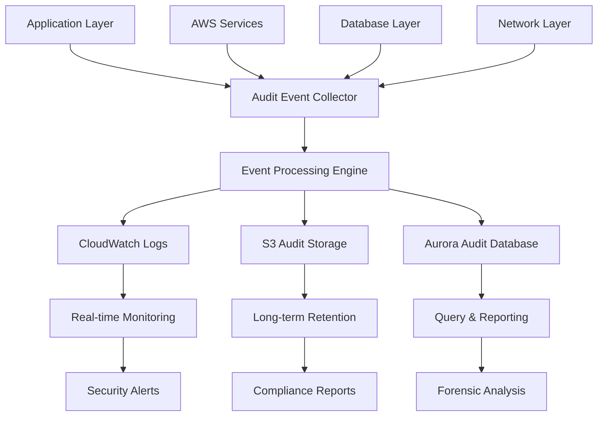

# Audit Logging Strategy
## Clinical Trial Data Collection Platform

**Document Version:** 1.0  
**Created:** August 4, 2025  
**Review Date:** February 4, 2026  
**Classification:** CONFIDENTIAL - INTERNAL USE ONLY

---

## Executive Summary

This document defines the comprehensive audit logging strategy for the Clinical Trial Data Collection Platform to ensure HIPAA compliance, security monitoring, and forensic capabilities. The strategy covers all system layers from infrastructure to application level, with specific focus on Protected Health Information (PHI) access and manipulation.

### Key Requirements
- **HIPAA Compliance:** 7-year retention period for all PHI-related events
- **Real-time Monitoring:** Security events processed within 5 minutes
- **Tamper Protection:** Cryptographically signed and immutable audit logs
- **Forensic Capability:** Detailed event reconstruction for incident response
- **Performance Impact:** < 5% application performance overhead

---

## 1. Audit Logging Framework

### 1.1 Logging Architecture



### 1.2 Audit Event Categories

#### Category 1: HIPAA-Required Events (Critical)
- Authentication attempts (success/failure)
- PHI access, creation, modification, deletion
- System access by privileged users
- User account creation, modification, deletion
- Permission changes and role assignments
- Data export and backup operations
- System configuration changes

#### Category 2: Security Events (High Priority)
- Failed login attempts and account lockouts
- Privilege escalation attempts
- Unusual access patterns or data queries
- File upload and download activities
- API rate limiting triggers
- WAF block events
- Network intrusion attempts

#### Category 3: Operational Events (Medium Priority)
- System startup and shutdown
- Service availability changes
- Performance threshold breaches
- Backup completion status
- Database maintenance activities
- Certificate renewal events

#### Category 4: Business Events (Low Priority)
- Study protocol changes
- Questionnaire modifications
- Report generation
- Data synchronization events
- Scheduled job executions

---

## 2. HIPAA Compliance Requirements

### 2.1 Required Audit Elements (§164.312(b))

Each audit log entry must include:

```json
{
  "timestamp": "ISO 8601 format with timezone",
  "event_id": "unique identifier for the event",
  "user_identification": {
    "user_id": "system user identifier",
    "username": "human-readable username",
    "role": "user role/permission level",
    "session_id": "unique session identifier"
  },
  "access_details": {
    "source_ip": "client IP address",
    "user_agent": "client application identifier",
    "device_id": "device fingerprint or identifier",
    "location": "geographic location if available"
  },
  "resource_information": {
    "resource_type": "type of resource accessed",
    "resource_id": "unique resource identifier",
    "data_classification": "PHI, PII, or public",
    "patient_id": "if PHI-related, patient identifier"
  },
  "action_details": {
    "action_type": "create, read, update, delete, export",
    "action_description": "human-readable description",
    "success": "boolean success indicator",
    "failure_reason": "reason for failure if applicable"
  },
  "system_information": {
    "application_component": "source system component",
    "version": "application version",
    "environment": "production, staging, development",
    "request_id": "correlation identifier"
  },
  "integrity_protection": {
    "hash": "SHA-256 hash of event data",
    "signature": "digital signature for tamper detection",
    "chain_hash": "hash linking to previous event"
  }
}
```

### 2.2 Audit Log Retention Requirements

| Data Type | Retention Period | Storage Location | Access Control |
|-----------|------------------|------------------|----------------|
| PHI Access Logs | 7 years minimum | S3 Glacier Deep Archive | Restricted to Security Team |
| Authentication Logs | 7 years | S3 Standard-IA → Glacier | Security Team + Compliance |
| System Logs | 3 years | CloudWatch → S3 | Operations Team |
| Application Logs | 2 years | CloudWatch Logs | Development Team |
| Network Logs | 1 year | S3 Standard | Infrastructure Team |

---

## 3. Infrastructure Audit Logging

### 3.1 AWS CloudTrail Configuration

```hcl
# Multi-region CloudTrail for comprehensive API auditing
resource "aws_cloudtrail" "clinical_trial_audit" {
  name                         = "clinical-trial-comprehensive-audit"
  s3_bucket_name              = aws_s3_bucket.audit_logs.bucket
  s3_key_prefix               = "cloudtrail-logs"
  include_global_service_events = true
  is_multi_region_trail       = true
  enable_logging              = true
  enable_log_file_validation  = true
  
  # KMS Encryption for audit logs
  kms_key_id = aws_kms_key.audit_logs_key.arn
  
  # Data Events for PHI-related resources
  event_selector {
    read_write_type                 = "All"
    include_management_events       = true
    
    # S3 Data Events
    data_resource {
      type   = "AWS::S3::Object"
      values = [
        "${aws_s3_bucket.clinical_documents.arn}/*",
        "${aws_s3_bucket.patient_uploads.arn}/*"
      ]
    }
    
    # Lambda Data Events
    data_resource {
      type   = "AWS::Lambda::Function"
      values = ["arn:aws:lambda:*:*:function:clinical-trial-*"]
    }
  }
  
  # Insight Selectors for anomaly detection
  insight_selector {
    insight_type = "ApiCallRateInsight"
  }
  
  tags = {
    Environment = "production"
    Purpose     = "HIPAA_Audit"
    RetentionYears = "7"
  }
}

# CloudWatch Logs integration
resource "aws_cloudwatch_log_group" "cloudtrail_logs" {
  name              = "/aws/cloudtrail/clinical-trial"
  retention_in_days = 2555  # 7 years
  kms_key_id       = aws_kms_key.audit_logs_key.arn
  
  tags = {
    Environment = "production"
    Purpose     = "Audit"
  }
}
```

### 3.2 VPC Flow Logs for Network Security

```hcl
# VPC Flow Logs with detailed monitoring
resource "aws_flow_log" "clinical_trial_detailed" {
  iam_role_arn    = aws_iam_role.flow_log_role.arn
  log_destination = aws_cloudwatch_log_group.vpc_flow_logs.arn
  traffic_type    = "ALL"
  vpc_id          = aws_vpc.clinical_trial_vpc.id
  
  # Custom format for detailed analysis
  log_format = "$${version} $${account-id} $${interface-id} $${srcaddr} $${dstaddr} $${srcport} $${dstport} $${protocol} $${packets} $${bytes} $${windowstart} $${windowend} $${action} $${flowlogstatus} $${tcp-flags} $${type} $${pkt-srcaddr} $${pkt-dstaddr}"
  
  tags = {
    Name = "clinical-trial-detailed-flow-logs"
    Purpose = "Security_Monitoring"
  }
}

# CloudWatch Log Group for VPC Flow Logs
resource "aws_cloudwatch_log_group" "vpc_flow_logs" {
  name              = "/aws/vpc/clinical-trial-flow-logs"
  retention_in_days = 365  # 1 year for network logs
  kms_key_id       = aws_kms_key.audit_logs_key.arn
  
  tags = {
    Environment = "production"
    Purpose     = "Network_Audit"
  }
}
```

### 3.3 WAF Logging Configuration

```hcl
# WAF Logging to CloudWatch
resource "aws_wafv2_web_acl_logging_configuration" "clinical_trial_waf_logging" {
  resource_arn            = aws_wafv2_web_acl.clinical_trial_waf.arn
  log_destination_configs = [aws_cloudwatch_log_group.waf_logs.arn]
  
  # Redact sensitive information
  redacted_fields {
    single_header {
      name = "authorization"
    }
  }
  
  redacted_fields {
    single_header {
      name = "cookie"
    }
  }
  
  # Sampling configuration
  logging_filter {
    default_behavior = "KEEP"
    
    filter {
      behavior    = "KEEP"
      condition {
        action_condition {
          action = "BLOCK"
        }
      }
      requirement = "MEETS_ANY"
    }
  }
}

# CloudWatch Log Group for WAF
resource "aws_cloudwatch_log_group" "waf_logs" {
  name              = "/aws/waf/clinical-trial"
  retention_in_days = 365
  kms_key_id       = aws_kms_key.audit_logs_key.arn
  
  tags = {
    Environment = "production"
    Purpose     = "WAF_Security_Audit"
  }
}
```

---

## 4. Application Layer Audit Logging

### 4.1 Structured Audit Event System

```typescript
// Audit Event Types
export enum AuditEventType {
  // Authentication Events
  LOGIN_SUCCESS = 'LOGIN_SUCCESS',
  LOGIN_FAILURE = 'LOGIN_FAILURE',
  LOGOUT = 'LOGOUT',
  PASSWORD_CHANGE = 'PASSWORD_CHANGE',
  MFA_SETUP = 'MFA_SETUP',
  MFA_VERIFICATION = 'MFA_VERIFICATION',
  
  // PHI Access Events
  PHI_CREATE = 'PHI_CREATE',
  PHI_READ = 'PHI_READ',
  PHI_UPDATE = 'PHI_UPDATE',
  PHI_DELETE = 'PHI_DELETE',
  PHI_EXPORT = 'PHI_EXPORT',
  PHI_PRINT = 'PHI_PRINT',
  
  // Administrative Events
  USER_CREATE = 'USER_CREATE',
  USER_UPDATE = 'USER_UPDATE',
  USER_DELETE = 'USER_DELETE',
  ROLE_ASSIGN = 'ROLE_ASSIGN',
  PERMISSION_CHANGE = 'PERMISSION_CHANGE',
  
  // System Events
  CONFIG_CHANGE = 'CONFIG_CHANGE',
  BACKUP_START = 'BACKUP_START',
  BACKUP_COMPLETE = 'BACKUP_COMPLETE',
  SYSTEM_ERROR = 'SYSTEM_ERROR'
}

// Enhanced Audit Event Interface
export interface AuditEvent {
  // Event Identification
  eventId: string;
  eventType: AuditEventType;
  timestamp: Date;
  
  // User Context
  userId: string;
  username: string;
  userRole: string;
  sessionId: string;
  
  // Access Context
  sourceIp: string;
  userAgent: string;
  deviceFingerprint?: string;
  geolocation?: {
    country: string;
    region: string;
    city: string;
  };
  
  // Resource Information
  resourceType: string;
  resourceId: string;
  dataClassification: 'PHI' | 'PII' | 'CONFIDENTIAL' | 'PUBLIC';
  patientId?: string;
  studyId?: string;
  
  // Action Details
  actionDescription: string;
  success: boolean;
  failureReason?: string;
  changesData?: any;
  
  // System Context
  applicationComponent: string;
  applicationVersion: string;
  environment: 'production' | 'staging' | 'development';
  requestId: string;
  
  // Integrity Protection
  eventHash: string;
  digitalSignature?: string;
  previousEventHash?: string;
}

// Audit Logger Implementation
export class EnhancedAuditLogger {
  private static instance: EnhancedAuditLogger;
  private eventChain: Map<string, string> = new Map();
  
  static getInstance(): EnhancedAuditLogger {
    if (!this.instance) {
      this.instance = new EnhancedAuditLogger();
    }
    return this.instance;
  }
  
  async logEvent(event: Partial<AuditEvent>, req?: Request): Promise<void> {
    // Enrich event with system information
    const enrichedEvent = await this.enrichEvent(event, req);
    
    // Add integrity protection
    const protectedEvent = this.addIntegrityProtection(enrichedEvent);
    
    // Log to multiple destinations
    await Promise.all([
      this.logToDatabase(protectedEvent),
      this.logToCloudWatch(protectedEvent),
      this.logToS3(protectedEvent),
      this.sendSecurityAlert(protectedEvent)
    ]);
  }
  
  private async enrichEvent(event: Partial<AuditEvent>, req?: Request): Promise<AuditEvent> {
    const enriched: AuditEvent = {
      eventId: crypto.randomUUID(),
      timestamp: new Date(),
      
      // Extract from request if available
      userId: req?.user?.id || event.userId || 'system',
      username: req?.user?.username || event.username || 'system',
      userRole: req?.user?.role || event.userRole || 'system',
      sessionId: req?.session?.id || event.sessionId || 'none',
      
      sourceIp: req?.ip || event.sourceIp || 'unknown',
      userAgent: req?.get('User-Agent') || event.userAgent || 'unknown',
      
      applicationComponent: 'clinical-trial-api',
      applicationVersion: process.env.APP_VERSION || '1.0.0',
      environment: process.env.NODE_ENV as any || 'development',
      requestId: req?.get('x-request-id') || crypto.randomUUID(),
      
      ...event
    } as AuditEvent;
    
    // Add geolocation if available
    if (enriched.sourceIp && enriched.sourceIp !== 'unknown') {
      enriched.geolocation = await this.getGeolocation(enriched.sourceIp);
    }
    
    return enriched;
  }
  
  private addIntegrityProtection(event: AuditEvent): AuditEvent {
    // Create hash of event data
    const eventData = JSON.stringify({
      ...event,
      eventHash: undefined,
      digitalSignature: undefined,
      previousEventHash: undefined
    });
    
    event.eventHash = crypto
      .createHash('sha256')
      .update(eventData)
      .digest('hex');
    
    // Add previous event hash for chain integrity
    const previousHash = this.eventChain.get(event.userId);
    if (previousHash) {
      event.previousEventHash = previousHash;
    }
    
    // Update chain
    this.eventChain.set(event.userId, event.eventHash);
    
    // Digital signature (implement with KMS or HSM)
    event.digitalSignature = this.signEvent(eventData);
    
    return event;
  }
  
  private signEvent(eventData: string): string {
    // Implementation would use AWS KMS or HSM for production
    return crypto
      .createHmac('sha256', process.env.AUDIT_SIGNING_KEY || 'default-key')
      .update(eventData)
      .digest('hex');
  }
  
  // PHI-specific audit helper
  static auditPHIAccess(
    req: Request, 
    action: 'CREATE' | 'READ' | 'UPDATE' | 'DELETE' | 'EXPORT',
    resourceId: string,
    patientId: string,
    success: boolean = true,
    additionalData?: any
  ): void {
    const logger = EnhancedAuditLogger.getInstance();
    
    logger.logEvent({
      eventType: AuditEventType[`PHI_${action}`] as AuditEventType,
      resourceType: 'patient_data',
      resourceId,
      dataClassification: 'PHI',
      patientId,
      actionDescription: `${action} PHI data for patient ${patientId}`,
      success,
      changesData: additionalData
    }, req);
  }
}
```

### 4.2 Database Audit Logging

```sql
-- Audit table for application events
CREATE TABLE audit_logs (
    id UUID PRIMARY KEY DEFAULT gen_random_uuid(),
    event_id UUID UNIQUE NOT NULL,
    event_type VARCHAR(50) NOT NULL,
    timestamp TIMESTAMP WITH TIME ZONE NOT NULL,
    
    -- User Information
    user_id UUID,
    username VARCHAR(255),
    user_role VARCHAR(100),
    session_id VARCHAR(255),
    
    -- Access Context
    source_ip INET,
    user_agent TEXT,
    device_fingerprint VARCHAR(255),
    geolocation JSONB,
    
    -- Resource Information
    resource_type VARCHAR(100) NOT NULL,
    resource_id VARCHAR(255),
    data_classification VARCHAR(20) NOT NULL,
    patient_id UUID,
    study_id UUID,
    
    -- Action Details
    action_description TEXT NOT NULL,
    success BOOLEAN NOT NULL,
    failure_reason TEXT,
    changes_data JSONB,
    
    -- System Context
    application_component VARCHAR(100),
    application_version VARCHAR(20),
    environment VARCHAR(20),
    request_id UUID,
    
    -- Integrity Protection
    event_hash VARCHAR(64) NOT NULL,
    digital_signature VARCHAR(255),
    previous_event_hash VARCHAR(64),
    
    -- Indexes for performance
    INDEX idx_audit_timestamp (timestamp),
    INDEX idx_audit_user_id (user_id),
    INDEX idx_audit_patient_id (patient_id),
    INDEX idx_audit_event_type (event_type),
    INDEX idx_audit_resource_type (resource_type),
    INDEX idx_audit_data_classification (data_classification)
);

-- Row-level security for audit logs
ALTER TABLE audit_logs ENABLE ROW LEVEL SECURITY;

-- Policy to restrict access to audit logs
CREATE POLICY audit_log_access_policy ON audit_logs
    FOR SELECT
    TO audit_readers
    USING (
        -- Only security team and compliance officers can read audit logs
        current_setting('clinical_trial.user_role') IN ('security_officer', 'compliance_officer', 'audit_analyst')
    );

-- Trigger for automatic audit logging of PHI table changes
CREATE OR REPLACE FUNCTION audit_phi_changes()
RETURNS TRIGGER AS $$
BEGIN
    -- Log PHI table modifications
    INSERT INTO audit_logs (
        event_id,
        event_type,
        timestamp,
        user_id,
        username,
        resource_type,
        resource_id,
        data_classification,
        patient_id,
        action_description,
        success,
        changes_data,
        event_hash
    ) VALUES (
        gen_random_uuid(),
        CASE TG_OP
            WHEN 'INSERT' THEN 'PHI_CREATE'
            WHEN 'UPDATE' THEN 'PHI_UPDATE'
            WHEN 'DELETE' THEN 'PHI_DELETE'
        END,
        NOW(),
        current_setting('clinical_trial.user_id')::UUID,
        current_setting('clinical_trial.username'),
        TG_TABLE_NAME,
        COALESCE(NEW.id::TEXT, OLD.id::TEXT),
        'PHI',
        COALESCE(NEW.patient_id, OLD.patient_id),
        format('%s operation on %s', TG_OP, TG_TABLE_NAME),
        true,
        CASE TG_OP
            WHEN 'INSERT' THEN row_to_json(NEW)
            WHEN 'UPDATE' THEN jsonb_build_object('old', row_to_json(OLD), 'new', row_to_json(NEW))
            WHEN 'DELETE' THEN row_to_json(OLD)
        END,
        -- Generate hash
        encode(digest(
            COALESCE(row_to_json(NEW)::text, row_to_json(OLD)::text) || 
            extract(epoch from now())::text, 'sha256'
        ), 'hex')
    );
    
    RETURN COALESCE(NEW, OLD);
END;
$$ LANGUAGE plpgsql SECURITY DEFINER;

-- Apply trigger to PHI tables
CREATE TRIGGER audit_patients_changes
    AFTER INSERT OR UPDATE OR DELETE ON patients
    FOR EACH ROW EXECUTE FUNCTION audit_phi_changes();

CREATE TRIGGER audit_medical_records_changes
    AFTER INSERT OR UPDATE OR DELETE ON medical_records
    FOR EACH ROW EXECUTE FUNCTION audit_phi_changes();
```

---

## 5. Real-Time Security Monitoring

### 5.1 CloudWatch Alarms and Metrics

```hcl
# Failed Authentication Alarm
resource "aws_cloudwatch_metric_alarm" "failed_authentication_alarm" {
  alarm_name          = "clinical-trial-failed-auth-attempts"
  comparison_operator = "GreaterThanThreshold"
  evaluation_periods  = "2"
  metric_name         = "FailedAuthentications"
  namespace           = "ClinicalTrial/Security"
  period              = "300"
  statistic           = "Sum"
  threshold           = "10"
  alarm_description   = "Multiple failed authentication attempts detected"
  alarm_actions       = [aws_sns_topic.security_alerts.arn]
  
  tags = {
    Purpose = "Security_Monitoring"
  }
}

# PHI Access Pattern Anomaly Alarm
resource "aws_cloudwatch_metric_alarm" "phi_access_anomaly" {
  alarm_name          = "clinical-trial-phi-access-anomaly"
  comparison_operator = "GreaterThanThreshold"
  evaluation_periods  = "1"
  metric_name         = "PHIAccessCount"
  namespace           = "ClinicalTrial/Security"
  period              = "900"  # 15 minutes
  statistic           = "Sum"
  threshold           = "100"  # Adjust based on normal patterns
  alarm_description   = "Unusual PHI access pattern detected"
  alarm_actions       = [aws_sns_topic.security_alerts.arn]
  
  tags = {
    Purpose = "HIPAA_Monitoring"
  }
}

# WAF Block Rate Alarm
resource "aws_cloudwatch_metric_alarm" "waf_high_block_rate" {
  alarm_name          = "clinical-trial-waf-high-block-rate"
  comparison_operator = "GreaterThanThreshold"
  evaluation_periods  = "2"
  metric_name         = "BlockedRequests"
  namespace           = "AWS/WAFV2"
  period              = "300"
  statistic           = "Sum"
  threshold           = "50"
  alarm_description   = "High number of blocked requests detected"
  alarm_actions       = [aws_sns_topic.security_alerts.arn]
  
  dimensions = {
    WebACL = aws_wafv2_web_acl.clinical_trial_waf.name
    Region = data.aws_region.current.name
  }
}
```

### 5.2 Custom Metrics and Dashboards

```typescript
// Custom Metrics Publisher
export class SecurityMetrics {
  private cloudWatch: CloudWatch;
  
  constructor() {
    this.cloudWatch = new CloudWatch({
      region: process.env.AWS_REGION || 'us-east-1'
    });
  }
  
  async publishAuthenticationMetric(success: boolean, userId?: string): Promise<void> {
    const metricData = [
      {
        MetricName: success ? 'SuccessfulAuthentications' : 'FailedAuthentications',
        Dimensions: [
          {
            Name: 'Environment',
            Value: process.env.NODE_ENV || 'development'
          }
        ],
        Unit: 'Count',
        Value: 1,
        Timestamp: new Date()
      }
    ];
    
    if (!success && userId) {
      // Track failed attempts per user
      metricData.push({
        MetricName: 'FailedAuthenticationsPerUser',
        Dimensions: [
          {
            Name: 'UserId',
            Value: userId
          }
        ],
        Unit: 'Count',
        Value: 1,
        Timestamp: new Date()
      });
    }
    
    await this.cloudWatch.putMetricData({
      Namespace: 'ClinicalTrial/Security',
      MetricData: metricData
    }).promise();
  }
  
  async publishPHIAccessMetric(
    action: string, 
    patientId: string, 
    userId: string,
    success: boolean
  ): Promise<void> {
    const metricData = [
      {
        MetricName: 'PHIAccessCount',
        Dimensions: [
          {
            Name: 'Action',
            Value: action
          },
          {
            Name: 'Success',
            Value: success.toString()
          }
        ],
        Unit: 'Count',
        Value: 1,
        Timestamp: new Date()
      },
      {
        MetricName: 'PHIAccessPerUser',
        Dimensions: [
          {
            Name: 'UserId',
            Value: userId
          },
          {
            Name: 'Action',
            Value: action
          }
        ],
        Unit: 'Count',
        Value: 1,
        Timestamp: new Date()
      }
    ];
    
    await this.cloudWatch.putMetricData({
      Namespace: 'ClinicalTrial/Security',
      MetricData: metricData
    }).promise();
  }
}
```

---

## 6. Log Storage and Retention

### 6.1 S3 Storage Configuration

```hcl
# S3 Bucket for Long-term Audit Log Storage
resource "aws_s3_bucket" "audit_logs" {
  bucket = "clinical-trial-audit-logs-${random_string.bucket_suffix.result}"
  
  tags = {
    Purpose = "Audit_Storage"
    Retention = "7_Years"
    Compliance = "HIPAA"
  }
}

# Server-side encryption with KMS
resource "aws_s3_bucket_server_side_encryption_configuration" "audit_logs_encryption" {
  bucket = aws_s3_bucket.audit_logs.id
  
  rule {
    apply_server_side_encryption_by_default {
      kms_master_key_id = aws_kms_key.audit_logs_key.arn
      sse_algorithm     = "aws:kms"
    }
    bucket_key_enabled = true
  }
}

# Lifecycle policy for cost optimization
resource "aws_s3_bucket_lifecycle_configuration" "audit_logs_lifecycle" {
  bucket = aws_s3_bucket.audit_logs.id
  
  rule {
    id     = "audit_logs_lifecycle"
    status = "Enabled"
    
    # Keep in Standard for 90 days
    transition {
      days          = 90
      storage_class = "STANDARD_IA"
    }
    
    # Move to Glacier after 1 year
    transition {
      days          = 365
      storage_class = "GLACIER"
    }
    
    # Move to Deep Archive after 3 years
    transition {
      days          = 1095
      storage_class = "DEEP_ARCHIVE"
    }
    
    # Delete after 7 years (HIPAA requirement)
    expiration {
      days = 2555
    }
  }
}

# Bucket notification for audit log analysis
resource "aws_s3_bucket_notification" "audit_logs_notification" {
  bucket = aws_s3_bucket.audit_logs.id
  
  lambda_function {
    lambda_function_arn = aws_lambda_function.audit_log_processor.arn
    events              = ["s3:ObjectCreated:*"]
    
    filter_prefix = "audit-logs/"
    filter_suffix = ".json"
  }
}
```

### 6.2 Log Integrity Verification

```typescript
// Log Integrity Verification Service
export class LogIntegrityService {
  async verifyLogChain(userId: string, startDate: Date, endDate: Date): Promise<boolean> {
    const logs = await this.getAuditLogsForUser(userId, startDate, endDate);
    
    let previousHash: string | null = null;
    
    for (const log of logs) {
      // Verify individual log hash
      if (!this.verifyLogHash(log)) {
        console.error(`Log integrity violation: Invalid hash for event ${log.eventId}`);
        return false;
      }
      
      // Verify chain integrity
      if (previousHash && log.previousEventHash !== previousHash) {
        console.error(`Chain integrity violation: Event ${log.eventId} has invalid previous hash`);
        return false;
      }
      
      // Verify digital signature
      if (!this.verifyDigitalSignature(log)) {
        console.error(`Signature verification failed for event ${log.eventId}`);
        return false;
      }
      
      previousHash = log.eventHash;
    }
    
    return true;
  }
  
  private verifyLogHash(log: AuditEvent): boolean {
    const eventData = JSON.stringify({
      ...log,
      eventHash: undefined,
      digitalSignature: undefined,
      previousEventHash: undefined
    });
    
    const calculatedHash = crypto
      .createHash('sha256')
      .update(eventData)
      .digest('hex');
    
    return calculatedHash === log.eventHash;
  }
  
  private verifyDigitalSignature(log: AuditEvent): boolean {
    const eventData = JSON.stringify({
      ...log,
      eventHash: undefined,
      digitalSignature: undefined,
      previousEventHash: undefined
    });
    
    const expectedSignature = crypto
      .createHmac('sha256', process.env.AUDIT_SIGNING_KEY || 'default-key')
      .update(eventData)
      .digest('hex');
    
    return expectedSignature === log.digitalSignature;
  }
}
```

---

## 7. Compliance Reporting and Analytics

### 7.1 HIPAA Compliance Reports

```typescript
// HIPAA Compliance Report Generator
export class HIPAAComplianceReporter {
  async generateMonthlyReport(month: number, year: number): Promise<HIPAAComplianceReport> {
    const startDate = new Date(year, month - 1, 1);
    const endDate = new Date(year, month, 0);
    
    const report: HIPAAComplianceReport = {
      reportPeriod: {
        start: startDate,
        end: endDate
      },
      
      // Authentication Events
      authenticationEvents: await this.getAuthenticationSummary(startDate, endDate),
      
      // PHI Access Events
      phiAccessEvents: await this.getPHIAccessSummary(startDate, endDate),
      
      // Security Incidents
      securityIncidents: await this.getSecurityIncidents(startDate, endDate),
      
      // User Activity
      userActivity: await this.getUserActivitySummary(startDate, endDate),
      
      // System Events
      systemEvents: await this.getSystemEventsSummary(startDate, endDate),
      
      // Compliance Metrics
      complianceMetrics: await this.calculateComplianceMetrics(startDate, endDate)
    };
    
    return report;
  }
  
  private async getPHIAccessSummary(startDate: Date, endDate: Date): Promise<PHIAccessSummary> {
    const query = `
      SELECT 
        event_type,
        COUNT(*) as event_count,
        COUNT(DISTINCT user_id) as unique_users,
        COUNT(DISTINCT patient_id) as unique_patients,
        COUNT(CASE WHEN success = false THEN 1 END) as failed_attempts
      FROM audit_logs 
      WHERE timestamp BETWEEN $1 AND $2 
        AND data_classification = 'PHI'
        AND event_type IN ('PHI_CREATE', 'PHI_READ', 'PHI_UPDATE', 'PHI_DELETE', 'PHI_EXPORT')
      GROUP BY event_type
      ORDER BY event_count DESC
    `;
    
    const results = await DatabaseQuery.executeQuery(query, [startDate, endDate]);
    
    return {
      totalPHIAccess: results.reduce((sum, row) => sum + parseInt(row.event_count), 0),
      accessByType: results.map(row => ({
        type: row.event_type,
        count: parseInt(row.event_count),
        uniqueUsers: parseInt(row.unique_users),
        uniquePatients: parseInt(row.unique_patients),
        failedAttempts: parseInt(row.failed_attempts)
      })),
      topUsers: await this.getTopPHIAccessUsers(startDate, endDate),
      suspiciousActivity: await this.getSuspiciousPHIActivity(startDate, endDate)
    };
  }
}

interface HIPAAComplianceReport {
  reportPeriod: {
    start: Date;
    end: Date;
  };
  authenticationEvents: AuthenticationSummary;
  phiAccessEvents: PHIAccessSummary;
  securityIncidents: SecurityIncident[];
  userActivity: UserActivitySummary;
  systemEvents: SystemEventsSummary;
  complianceMetrics: ComplianceMetrics;
}
```

### 7.2 Automated Compliance Validation

```typescript
// Automated Compliance Checker
export class ComplianceValidator {
  async validateHIPAACompliance(): Promise<ComplianceValidationResult> {
    const validationResults: ComplianceCheck[] = [];
    
    // Check 1: Audit logging completeness
    validationResults.push(await this.checkAuditLoggingCompleteness());
    
    // Check 2: Log retention compliance
    validationResults.push(await this.checkLogRetentionCompliance());
    
    // Check 3: Access control audit trail
    validationResults.push(await this.checkAccessControlAuditTrail());
    
    // Check 4: PHI access logging
    validationResults.push(await this.checkPHIAccessLogging());
    
    // Check 5: Log integrity verification
    validationResults.push(await this.checkLogIntegrity());
    
    // Check 6: User activity monitoring
    validationResults.push(await this.checkUserActivityMonitoring());
    
    const overallCompliance = validationResults.every(check => check.status === 'PASS');
    
    return {
      overallStatus: overallCompliance ? 'COMPLIANT' : 'NON_COMPLIANT',
      validationDate: new Date(),
      checks: validationResults,
      recommendations: this.generateRecommendations(validationResults)
    };
  }
  
  private async checkAuditLoggingCompleteness(): Promise<ComplianceCheck> {
    // Verify all required events are being logged
    const requiredEvents = [
      'LOGIN_SUCCESS', 'LOGIN_FAILURE', 'LOGOUT',
      'PHI_CREATE', 'PHI_READ', 'PHI_UPDATE', 'PHI_DELETE',
      'USER_CREATE', 'USER_UPDATE', 'ROLE_ASSIGN'
    ];
    
    const query = `
      SELECT DISTINCT event_type 
      FROM audit_logs 
      WHERE timestamp >= NOW() - INTERVAL '24 hours'
    `;
    
    const loggedEvents = await DatabaseQuery.executeQuery(query, []);
    const loggedEventTypes = loggedEvents.map(row => row.event_type);
    
    const missingEvents = requiredEvents.filter(
      event => !loggedEventTypes.includes(event)
    );
    
    return {
      checkName: 'Audit Logging Completeness',
      status: missingEvents.length === 0 ? 'PASS' : 'FAIL',
      details: missingEvents.length === 0 
        ? 'All required events are being logged'
        : `Missing events: ${missingEvents.join(', ')}`,
      timestamp: new Date()
    };
  }
}
```

---

## 8. Performance Optimization

### 8.1 Log Processing Pipeline

```typescript
// Asynchronous Log Processing
export class LogProcessingPipeline {
  private logQueue: Queue<AuditEvent> = new Queue('audit-logs');
  private batchProcessor: BatchProcessor;
  
  constructor() {
    this.batchProcessor = new BatchProcessor({
      batchSize: 100,
      flushInterval: 5000, // 5 seconds
      maxRetries: 3
    });
    
    this.setupProcessing();
  }
  
  async queueLogEvent(event: AuditEvent): Promise<void> {
    // Add to processing queue for async handling
    await this.logQueue.add('process-audit-event', event, {
      priority: this.getEventPriority(event),
      attempts: 3,
      backoff: {
        type: 'exponential',
        delay: 2000
      }
    });
  }
  
  private getEventPriority(event: AuditEvent): number {
    // High priority for security events
    if (event.eventType.includes('PHI_') || 
        event.eventType.includes('LOGIN_FAILURE') ||
        !event.success) {
      return 10;
    }
    
    // Medium priority for authentication events
    if (event.eventType.includes('LOGIN_') || 
        event.eventType.includes('LOGOUT')) {
      return 5;
    }
    
    // Low priority for other events
    return 1;
  }
  
  private setupProcessing(): void {
    this.logQueue.process('process-audit-event', async (job) => {
      const event = job.data as AuditEvent;
      
      try {
        // Batch processing for efficiency
        await this.batchProcessor.add(event);
        
        // Real-time alerting for critical events
        if (this.isCriticalEvent(event)) {
          await this.sendRealTimeAlert(event);
        }
        
      } catch (error) {
        console.error('Error processing audit event:', error);
        throw error;
      }
    });
  }
}
```

### 8.2 Database Optimization

```sql
-- Partitioned audit logs table for performance
CREATE TABLE audit_logs_partitioned (
    LIKE audit_logs INCLUDING ALL
) PARTITION BY RANGE (timestamp);

-- Monthly partitions for efficient querying
CREATE TABLE audit_logs_2025_08 PARTITION OF audit_logs_partitioned
    FOR VALUES FROM ('2025-08-01') TO ('2025-09-01');

CREATE TABLE audit_logs_2025_09 PARTITION OF audit_logs_partitioned
    FOR VALUES FROM ('2025-09-01') TO ('2025-10-01');

-- Automated partition management
CREATE OR REPLACE FUNCTION create_monthly_audit_partition()
RETURNS void AS $$
DECLARE
    start_date date;
    end_date date;
    partition_name text;
BEGIN
    start_date := date_trunc('month', CURRENT_DATE + interval '1 month');
    end_date := start_date + interval '1 month';
    partition_name := 'audit_logs_' || to_char(start_date, 'YYYY_MM');
    
    EXECUTE format(
        'CREATE TABLE IF NOT EXISTS %I PARTITION OF audit_logs_partitioned
         FOR VALUES FROM (%L) TO (%L)',
        partition_name, start_date, end_date
    );
END;
$$ LANGUAGE plpgsql;

-- Schedule monthly partition creation
SELECT cron.schedule('create-audit-partitions', '0 0 1 * *', 'SELECT create_monthly_audit_partition();');

-- Indexes for optimal query performance
CREATE INDEX CONCURRENTLY idx_audit_logs_timestamp_user_id 
ON audit_logs_partitioned (timestamp, user_id);

CREATE INDEX CONCURRENTLY idx_audit_logs_patient_id_timestamp 
ON audit_logs_partitioned (patient_id, timestamp) 
WHERE patient_id IS NOT NULL;

CREATE INDEX CONCURRENTLY idx_audit_logs_event_type_timestamp 
ON audit_logs_partitioned (event_type, timestamp);
```

---

## 9. Implementation Timeline

### Phase 1: Foundation (Weeks 1-2)
- [ ] Basic audit logging infrastructure setup
- [ ] CloudTrail configuration with data events
- [ ] Database audit table creation
- [ ] Basic application audit event capture

### Phase 2: Enhancement (Weeks 3-4)
- [ ] Real-time monitoring and alerting
- [ ] Log integrity protection implementation
- [ ] Performance optimization and batching
- [ ] WAF and VPC Flow Logs integration

### Phase 3: Compliance (Weeks 5-6)
- [ ] HIPAA compliance reporting system
- [ ] Automated compliance validation
- [ ] Long-term storage and lifecycle policies
- [ ] Forensic analysis capabilities

### Phase 4: Testing and Validation (Weeks 7-8)
- [ ] End-to-end audit trail testing
- [ ] Performance impact assessment
- [ ] Compliance validation testing
- [ ] Security team training and handover

---

## 10. Success Metrics and KPIs

### 10.1 Technical Metrics
- **Log Completeness:** 100% of required events captured
- **Processing Latency:** < 5 seconds for critical events
- **Storage Efficiency:** < 10% storage overhead
- **Query Performance:** < 2 seconds for compliance reports
- **System Impact:** < 5% application performance overhead

### 10.2 Compliance Metrics
- **HIPAA Compliance Score:** 100%
- **Audit Coverage:** 100% of PHI operations logged
- **Log Integrity:** 100% verification success rate
- **Retention Compliance:** 100% adherence to 7-year requirement
- **Access Traceability:** 100% user actions traceable

### 10.3 Security Metrics
- **Incident Response Time:** < 15 minutes for critical alerts
- **False Positive Rate:** < 2% for security alerts
- **Log Tampering Detection:** 100% detection rate
- **Forensic Capability:** Complete event reconstruction
- **Compliance Audit Results:** Zero findings

---

## Document Control and Approval

**Document Owner:** Chief Information Security Officer  
**Technical Lead:** Lead Security Engineer  
**Compliance Review:** Chief Privacy Officer  

**Review Schedule:**
- Monthly: Metrics and performance review
- Quarterly: Compliance validation
- Annually: Full strategy review and update

**Approval Authority:**
- [ ] Chief Information Security Officer
- [ ] Chief Technology Officer  
- [ ] Chief Privacy Officer
- [ ] Chief Compliance Officer

---

**CONFIDENTIAL - INTERNAL USE ONLY**  
This document contains sensitive security and compliance information and must be handled according to organizational data classification policies.