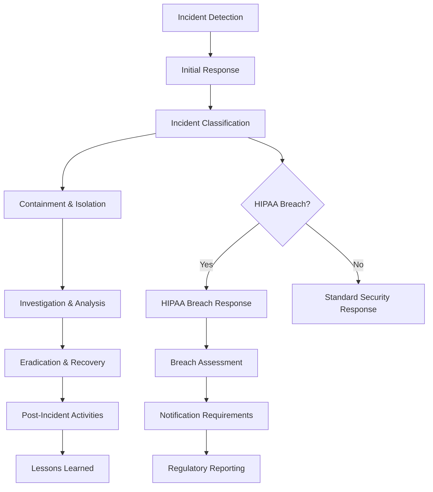
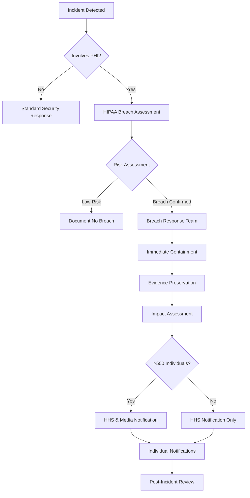

# Incident Response Plan
## Clinical Trial Data Collection Platform

**Document Version:** 1.0  
**Created:** August 4, 2025  
**Review Date:** February 4, 2026  
**Classification:** CONFIDENTIAL - INTERNAL USE ONLY

---

## Executive Summary

This document provides a comprehensive incident response plan for the Clinical Trial Data Collection Platform, with specific focus on HIPAA breach response, cybersecurity incidents, and healthcare data protection. The plan ensures rapid containment, thorough investigation, and proper notification procedures for all security incidents.

### Key Response Objectives
- **Containment:** Stop the incident within 1 hour of detection
- **Investigation:** Complete initial assessment within 4 hours
- **Notification:** HIPAA breach notification within 60 days if required
- **Recovery:** Restore normal operations within 24 hours
- **Lessons Learned:** Complete post-incident review within 1 week

---

## 1. Incident Response Framework

### 1.1 Response Phases



### 1.2 Incident Response Team (IRT)

#### Core Team Members
- **Incident Commander:** Chief Information Security Officer
- **Technical Lead:** Lead Security Engineer
- **HIPAA Officer:** Chief Privacy Officer
- **Legal Counsel:** General Counsel or External Legal
- **Communications Lead:** Chief Marketing Officer
- **Business Lead:** Chief Technology Officer

#### Extended Team Members
- Infrastructure Security Engineer
- Application Security Engineer
- Database Administrator
- Network Administrator
- HR Director (for insider threats)
- Public Relations Manager (for media response)

### 1.3 Contact Information

| Role | Primary Contact | Backup Contact | 24/7 Phone |
|------|----------------|----------------|-------------|
| Incident Commander | CISO | Deputy CISO | +1-555-0101 |
| Technical Lead | Lead Security Engineer | Senior Security Engineer | +1-555-0102 |
| HIPAA Officer | Chief Privacy Officer | Privacy Analyst | +1-555-0103 |
| Legal Counsel | General Counsel | External Legal Firm | +1-555-0104 |

---

## 2. Incident Classification System

### 2.1 Severity Levels

#### CRITICAL (Level 1)
**Response Time:** 15 minutes  
**Escalation:** Immediate to Incident Commander and C-Level

**Criteria:**
- Confirmed PHI breach affecting >500 individuals
- Ransomware infection on production systems
- Complete system outage affecting patient care
- Ongoing data exfiltration detected
- Unauthorized access to clinical trial databases
- Public disclosure of confidential clinical data

**Examples:**
- Database containing patient records compromised
- Ransomware encrypting clinical trial data
- Insider threat with administrative access stealing PHI
- External attacker accessing multiple patient records

#### HIGH (Level 2)
**Response Time:** 1 hour  
**Escalation:** Incident Commander and Department Heads

**Criteria:**
- PHI breach affecting <500 individuals
- Malware detection on production systems
- Unauthorized access to non-critical systems
- Significant service degradation
- Suspected insider threat activity
- Failed security control bypass attempts

**Examples:**
- Single patient record accessed without authorization
- Phishing attack targeting clinical staff
- Malware detected on workstation with PHI access
- Suspicious database queries indicating reconnaissance

#### MEDIUM (Level 3)
**Response Time:** 4 hours  
**Escalation:** Security Team and IT Management

**Criteria:**
- Policy violations by authorized users
- Failed security controls or misconfigurations
- Suspicious network activity without confirmed breach
- Physical security incidents
- Vendor security incidents affecting our data

**Examples:**
- Employee accessing patient data outside job responsibilities
- Misconfigured security group allowing broader access
- Unusual login patterns from authorized users
- Lost or stolen device with encrypted PHI

#### LOW (Level 4)
**Response Time:** 24 hours  
**Escalation:** Security Team

**Criteria:**
- Minor policy violations
- Routine security alerts requiring investigation
- Non-critical system anomalies
- Training or awareness issues

**Examples:**
- Password policy violations
- Routine vulnerability scan findings
- Minor configuration drift
- User education opportunities

### 2.2 Incident Types

#### Data Breach Incidents
- **Definition:** Unauthorized access, use, or disclosure of PHI
- **Special Requirements:** HIPAA breach assessment and notification
- **Examples:** Database intrusion, email misdirection, lost devices

#### Cybersecurity Incidents
- **Definition:** Malicious cyber activity affecting systems or data
- **Special Requirements:** FBI/CISA reporting if nation-state actor
- **Examples:** Malware, DDoS attacks, system intrusions

#### Insider Threat Incidents
- **Definition:** Threats originating from employees or contractors
- **Special Requirements:** HR involvement and legal consultation
- **Examples:** Data theft, sabotage, unauthorized access

#### Physical Security Incidents
- **Definition:** Physical threats to facilities or equipment
- **Special Requirements:** Facility security and local law enforcement
- **Examples:** Break-ins, theft, social engineering

---

## 3. HIPAA Breach Response Procedures

### 3.1 Breach Assessment Process

#### Step 1: Initial Breach Determination (Within 1 Hour)
```yaml
Initial Assessment Checklist:
  - [ ] Identify affected systems and data types
  - [ ] Determine if PHI was involved
  - [ ] Assess scope of potential exposure
  - [ ] Document timeline of events
  - [ ] Preserve evidence and logs
  - [ ] Implement immediate containment
```

#### Step 2: Four-Factor Risk Assessment (Within 24 Hours)
Per HIPAA Breach Notification Rule, assess:

1. **Nature and Extent of PHI Involved**
   - Types of identifiers (names, SSNs, medical records)
   - Number of individuals affected
   - Sensitivity of information

2. **Unauthorized Person Who Used/Disclosed PHI**
   - Identity and relationship to organization
   - Intent and capability to misuse information
   - Evidence of actual misuse

3. **Whether PHI Was Actually Viewed or Acquired**
   - Technical analysis of access logs
   - Forensic evidence of data viewing/copying
   - System capabilities and user actions

4. **Extent to Which Risk Has Been Mitigated**
   - Security measures in place
   - Actions taken to reduce harm
   - Assurances from unauthorized recipient

### 3.2 HIPAA Notification Requirements

#### Individual Notifications (Within 60 Days)
**Required Content:**
- Brief description of the breach
- Types of information involved
- Steps individuals should take to protect themselves
- What the organization is doing to investigate and mitigate
- Contact information for questions

**Delivery Methods:**
- Written notice by first-class mail (preferred)
- Email if individual agreed to electronic notice
- Substitute notice if contact information insufficient

#### HHS Notification (Within 60 Days)
**Information Required:**
- Name of covered entity
- Description of breach
- Number of individuals affected
- Date of breach and discovery
- Brief description of PHI involved
- Steps taken to mitigate harm

#### Media Notification (If >500 Individuals)
**Requirements:**
- Notice to prominent media outlets
- Same information as individual notification
- Posted on organization website for 90 days

### 3.3 HIPAA Breach Response Workflow



---

## 4. Technical Response Procedures

### 4.1 Immediate Response Actions

#### Containment Procedures
```bash
# Emergency containment script
#!/bin/bash

# 1. Isolate affected systems
aws ec2 revoke-security-group-ingress --group-id sg-affected --protocol all

# 2. Disable compromised user accounts
aws cognito-idp admin-disable-user --user-pool-id $USER_POOL_ID --username $COMPROMISED_USER

# 3. Rotate critical credentials
aws secretsmanager update-secret --secret-id $DATABASE_SECRET --secret-string $NEW_CREDENTIALS

# 4. Enable enhanced logging
aws logs put-retention-policy --log-group-name /aws/lambda/clinical-trial --retention-in-days 90

# 5. Create forensic snapshots
aws ec2 create-snapshot --volume-id $AFFECTED_VOLUME --description "Forensic snapshot - Incident $INCIDENT_ID"
```

#### Evidence Preservation
1. **System Snapshots**
   - Create EBS snapshots of affected instances
   - Preserve current state before remediation
   - Tag with incident ID and timestamp

2. **Log Collection**
   - Export CloudTrail logs for analysis period
   - Collect application logs from affected timeframe
   - Preserve database transaction logs
   - Export VPC Flow Logs and WAF logs

3. **Memory Acquisition**
   - Capture memory dumps from running instances
   - Preserve volatile data before shutdown
   - Document running processes and network connections

4. **Network Evidence**
   - Packet captures from affected network segments
   - DNS query logs and proxy logs
   - Firewall and IDS/IPS logs

### 4.2 Investigation Procedures

#### Forensic Analysis Workflow
```python
# Automated forensic data collection
import boto3
import datetime
from typing import List, Dict

class IncidentForensics:
    def __init__(self, incident_id: str):
        self.incident_id = incident_id
        self.ec2 = boto3.client('ec2')
        self.logs = boto3.client('logs')
        self.s3 = boto3.client('s3')
        
    def collect_evidence(self, affected_resources: List[str]) -> Dict:
        evidence = {
            'incident_id': self.incident_id,
            'collection_time': datetime.utcnow().isoformat(),
            'snapshots': [],
            'logs': [],
            'artifacts': []
        }
        
        for resource in affected_resources:
            # Create forensic snapshots
            if resource.startswith('i-'):  # EC2 instance
                evidence['snapshots'].extend(
                    self._create_instance_snapshots(resource)
                )
            
            # Collect relevant logs
            evidence['logs'].extend(
                self._collect_logs_for_resource(resource)
            )
        
        # Store evidence in secure S3 bucket
        self._store_evidence(evidence)
        return evidence
    
    def _create_instance_snapshots(self, instance_id: str) -> List[str]:
        # Get instance volumes
        response = self.ec2.describe_instances(InstanceIds=[instance_id])
        snapshots = []
        
        for reservation in response['Reservations']:
            for instance in reservation['Instances']:
                for block_device in instance.get('BlockDeviceMappings', []):
                    volume_id = block_device['Ebs']['VolumeId']
                    
                    # Create snapshot
                    snapshot_response = self.ec2.create_snapshot(
                        VolumeId=volume_id,
                        Description=f'Forensic snapshot - Incident {self.incident_id}',
                        TagSpecifications=[{
                            'ResourceType': 'snapshot',
                            'Tags': [
                                {'Key': 'IncidentId', 'Value': self.incident_id},
                                {'Key': 'Purpose', 'Value': 'Forensics'},
                                {'Key': 'CreatedBy', 'Value': 'IncidentResponse'}
                            ]
                        }]
                    )
                    snapshots.append(snapshot_response['SnapshotId'])
        
        return snapshots
```

#### Timeline Reconstruction
1. **Log Correlation**
   - CloudTrail API calls analysis
   - Application log timeline
   - Database access patterns
   - Network traffic analysis

2. **Attack Vector Analysis**
   - Entry point identification
   - Lateral movement tracking
   - Data access patterns
   - Persistence mechanisms

3. **Impact Assessment**
   - Affected data identification
   - System compromise extent
   - Business process impact
   - Compliance implications

### 4.3 Eradication and Recovery

#### Malware Removal
```bash
# Malware eradication procedures
#!/bin/bash

INCIDENT_ID=$1
AFFECTED_INSTANCE=$2

# 1. Isolate instance
aws ec2 modify-instance-attribute --instance-id $AFFECTED_INSTANCE --groups sg-quarantine

# 2. Create clean AMI from known good backup
aws ec2 create-image --instance-id $CLEAN_BACKUP_INSTANCE --name "clean-restore-$INCIDENT_ID"

# 3. Terminate compromised instance
aws ec2 terminate-instances --instance-ids $AFFECTED_INSTANCE

# 4. Launch clean replacement
aws ec2 run-instances --image-id $CLEAN_AMI --instance-type t3.medium --security-groups sg-production

# 5. Update security groups and NACLs
aws ec2 authorize-security-group-ingress --group-id sg-production --protocol tcp --port 443 --cidr 0.0.0.0/0
```

#### Account Security Reset
```python
# Comprehensive account security reset
class SecurityReset:
    def __init__(self):
        self.cognito = boto3.client('cognito-idp')
        self.iam = boto3.client('iam')
    
    def reset_compromised_accounts(self, user_list: List[str]):
        for username in user_list:
            # Force password reset
            self.cognito.admin_reset_user_password(
                UserPoolId=USER_POOL_ID,
                Username=username
            )
            
            # Revoke all refresh tokens
            self.cognito.admin_user_global_sign_out(
                UserPoolId=USER_POOL_ID,
                Username=username
            )
            
            # Require MFA re-setup
            self.cognito.admin_set_user_mfa_preference(
                UserPoolId=USER_POOL_ID,
                Username=username,
                SMSMfaSettings={'Enabled': True, 'PreferredMfa': True}
            )
```

#### System Hardening
1. **Patch Management**
   - Apply latest security patches
   - Update all system components
   - Verify patch integrity

2. **Configuration Review**
   - Security group rules audit
   - IAM policy review
   - Database permission verification
   - Application configuration check

3. **Monitoring Enhancement**
   - Additional log sources
   - Enhanced alerting rules
   - Behavioral analysis setup
   - Threat intelligence integration

---

## 5. Communication Procedures

### 5.1 Internal Communications

#### Executive Notification Template
```
SUBJECT: CRITICAL SECURITY INCIDENT - IMMEDIATE ATTENTION REQUIRED

Incident ID: [INCIDENT_ID]
Severity Level: [CRITICAL/HIGH/MEDIUM/LOW]
Detection Time: [TIMESTAMP]
Incident Commander: [NAME]

SUMMARY:
[Brief description of the incident]

IMPACT:
- Systems Affected: [LIST]
- Data Involved: [PHI/PII/OTHER]
- Number of Patients: [NUMBER]
- Business Impact: [DESCRIPTION]

IMMEDIATE ACTIONS TAKEN:
- [ACTION 1]
- [ACTION 2]
- [ACTION 3]

NEXT STEPS:
- [NEXT STEP 1 - TIME]
- [NEXT STEP 2 - TIME]
- [NEXT STEP 3 - TIME]

STATUS UPDATES: Every [FREQUENCY] until resolved

Contact: [INCIDENT COMMANDER CONTACT]
```

#### Status Update Template
```
SUBJECT: INCIDENT UPDATE - [INCIDENT_ID] - [STATUS]

Incident ID: [INCIDENT_ID]
Update Time: [TIMESTAMP]
Status: [INVESTIGATING/CONTAINED/RESOLVED]

PROGRESS UPDATE:
[Detailed progress since last update]

CURRENT ACTIVITIES:
- [ACTIVITY 1]
- [ACTIVITY 2]

ESTIMATED RESOLUTION: [TIME/TBD]

NEXT UPDATE: [TIME]

Contact: [INCIDENT COMMANDER CONTACT]
```

### 5.2 External Communications

#### Customer Notification (Non-Breach)
```
Subject: Important Security Notice - System Maintenance

Dear [Customer Name],

We are writing to inform you about a recent security incident that affected our systems. Please be assured that we have taken immediate action to address this issue and protect your information.

WHAT HAPPENED:
[Brief, non-technical description]

INFORMATION INVOLVED:
[Description of data types, if any]

WHAT WE ARE DOING:
- Immediately secured the affected systems
- Launched comprehensive investigation
- Implemented additional security measures
- Reported to appropriate authorities

WHAT YOU CAN DO:
[Specific recommendations if any]

We sincerely apologize for any inconvenience this may cause. If you have questions, please contact us at [CONTACT INFO].

Sincerely,
[EXECUTIVE SIGNATURE]
```

#### HIPAA Breach Notification Letter
```
[Date]

Dear [Patient Name],

We are writing to inform you of a recent incident that may have involved some of your protected health information. We take the privacy and security of your information very seriously, and we sincerely apologize that this incident occurred.

WHAT HAPPENED:
[Detailed description of the incident]

INFORMATION INVOLVED:
The information that may have been involved includes:
- [Specific data elements]
- [Date range of information]

WHAT WE ARE DOING:
Immediately upon discovery, we:
- [Specific actions taken]
- [Investigation details]
- [Remediation measures]

WHAT YOU CAN DO:
[Specific recommendations and resources]

For more information or if you have questions, please contact our Privacy Officer at [CONTACT INFORMATION].

Sincerely,
[HIPAA SECURITY OFFICER SIGNATURE]
```

### 5.3 Media Response

#### Media Statement Template
```
[Organization Name] Security Incident Statement

[Date] - [Organization Name] recently became aware of a security incident involving our systems. We immediately took action to secure our systems and launched a comprehensive investigation with leading cybersecurity experts.

The security of our systems and the privacy of patient information are our highest priorities. We have implemented additional security measures and are working closely with law enforcement and regulatory authorities.

[If PHI involved]: We are in the process of notifying affected individuals in accordance with HIPAA requirements and providing them with information about steps they can take to protect themselves.

We will continue to monitor our systems and will provide updates as appropriate. For questions, please contact [CONTACT INFORMATION].

Contact:
[Media Relations Contact]
[Phone Number]
[Email Address]
```

---

## 6. Legal and Regulatory Requirements

### 6.1 HIPAA Compliance Requirements

#### Breach Notification Deadlines
- **Individual Notification:** 60 days from discovery
- **HHS Notification:** 60 days from discovery
- **Media Notification:** 60 days from discovery (if >500 individuals)
- **Annual Summary:** For breaches <500 individuals

#### Required Documentation
- **Breach Risk Assessment:** Four-factor analysis
- **Notification Letters:** Copies of all notifications sent
- **Media Notices:** Documentation of media outreach
- **Investigation Report:** Complete incident analysis
- **Remediation Plan:** Actions taken to prevent recurrence

### 6.2 Other Regulatory Requirements

#### FDA 21 CFR Part 11 (If Applicable)
- Electronic record integrity validation
- Audit trail preservation
- System validation documentation
- Change control procedures

#### State Breach Notification Laws
- Review applicable state requirements
- Determine additional notification obligations
- Document compliance with state laws

#### International Requirements (If Applicable)
- **GDPR:** 72-hour regulatory notification
- **Other:** Review applicable international laws

### 6.3 Law Enforcement Reporting

#### FBI Reporting Criteria
- Nation-state actor involvement
- Organized crime indicators
- Significant financial impact
- Critical infrastructure targeting

#### Reporting Process
1. Contact FBI Cyber Division
2. Provide initial incident details
3. Coordinate with legal counsel
4. Maintain chain of custody for evidence
5. Support ongoing investigation

---

## 7. Recovery and Business Continuity

### 7.1 System Recovery Procedures

#### Priority Recovery Order
1. **Critical Systems (RTO: 4 hours)**
   - Authentication services (AWS Cognito)
   - Core database systems (Aurora)
   - Essential API endpoints

2. **High Priority Systems (RTO: 8 hours)**
   - Web application frontend
   - File storage systems (S3)
   - Monitoring and alerting

3. **Medium Priority Systems (RTO: 24 hours)**
   - Reporting systems
   - Administrative interfaces
   - Development environments

4. **Low Priority Systems (RTO: 72 hours)**
   - Archive systems
   - Training environments
   - Documentation systems

#### Recovery Validation Checklist
```yaml
System Recovery Validation:
  Authentication:
    - [ ] User login functionality
    - [ ] MFA enforcement
    - [ ] Password reset capability
    - [ ] Session management
  
  Database Systems:
    - [ ] Data integrity verification
    - [ ] Backup restoration
    - [ ] Encryption validation
    - [ ] Performance testing
  
  Applications:
    - [ ] Core functionality testing
    - [ ] Security control validation
    - [ ] Integration testing
    - [ ] User acceptance testing
  
  Security Controls:
    - [ ] WAF functionality
    - [ ] Monitoring and alerting
    - [ ] Access controls
    - [ ] Audit logging
```

### 7.2 Data Recovery Procedures

#### Database Recovery
```sql
-- Database recovery validation queries
-- 1. Verify data integrity
SELECT COUNT(*) FROM patients WHERE created_at >= '[INCIDENT_START_TIME]';

-- 2. Check encryption status
SELECT COUNT(*) FROM patients WHERE first_name IS NULL OR last_name IS NULL;

-- 3. Validate audit trail continuity
SELECT 
    MIN(timestamp) as earliest_log,
    MAX(timestamp) as latest_log,
    COUNT(*) as total_events
FROM audit_logs 
WHERE timestamp BETWEEN '[RECOVERY_START]' AND '[RECOVERY_END]';

-- 4. Verify referential integrity
SELECT COUNT(*) FROM patients p 
LEFT JOIN studies s ON p.study_id = s.id 
WHERE s.id IS NULL;
```

#### File System Recovery
```bash
#!/bin/bash
# S3 data recovery and validation

INCIDENT_ID=$1
BACKUP_DATE=$2

# 1. Restore from backup
aws s3 sync s3://clinical-trial-backups/$BACKUP_DATE/ s3://clinical-trial-documents/

# 2. Verify file integrity
aws s3api head-object --bucket clinical-trial-documents --key manifest.json

# 3. Check encryption status
aws s3api get-bucket-encryption --bucket clinical-trial-documents

# 4. Validate access controls
aws s3api get-bucket-policy --bucket clinical-trial-documents
```

### 7.3 Business Impact Assessment

#### Service Level Impact Matrix
| Service | Incident Impact | Recovery Priority | Business Impact |
|---------|----------------|-------------------|-----------------|
| Patient Portal | Unable to submit forms | HIGH | Delayed data collection |
| Physician Portal | Cannot access patient data | CRITICAL | Clinical decision delays |
| Authentication | Users cannot login | CRITICAL | Complete service outage |
| Database | PHI potentially compromised | CRITICAL | Regulatory compliance |
| File Storage | Documents inaccessible | MEDIUM | Workflow disruption |

#### Financial Impact Assessment
- **Direct Costs:** Recovery expenses, consultant fees, legal costs
- **Regulatory Fines:** HIPAA penalties, state breach notification fines
- **Business Losses:** Service disruption, customer churn, reputation damage
- **Insurance Coverage:** Cyber liability policy applicability

---

## 8. Post-Incident Activities

### 8.1 Lessons Learned Process

#### Post-Incident Review Meeting
**Participants:**
- Incident Response Team members
- Affected department representatives
- Executive stakeholders
- External consultants (if involved)

**Agenda:**
1. Incident timeline review
2. Response effectiveness assessment
3. Communication evaluation
4. Technical control analysis
5. Process improvement recommendations
6. Training needs identification

#### Lessons Learned Report Template
```markdown
# Incident Post-Mortem Report

## Incident Summary
- **Incident ID:** [ID]
- **Date/Time:** [TIMESTAMP]
- **Duration:** [DURATION]
- **Severity:** [LEVEL]
- **Root Cause:** [CAUSE]

## Timeline of Events
[Detailed chronological timeline]

## Response Effectiveness
### What Went Well
- [Success 1]
- [Success 2]

### Areas for Improvement
- [Improvement 1]
- [Improvement 2]

## Root Cause Analysis
### Primary Cause
[Detailed analysis]

### Contributing Factors
- [Factor 1]
- [Factor 2]

## Recommendations
### Immediate Actions (0-30 days)
- [Action 1]
- [Action 2]

### Short-term Actions (1-3 months)
- [Action 1]
- [Action 2]

### Long-term Actions (3-12 months)
- [Action 1]
- [Action 2]

## Cost Impact
- **Direct Costs:** $[AMOUNT]
- **Estimated Business Impact:** $[AMOUNT]
- **Recovery Costs:** $[AMOUNT]
```

### 8.2 Process Improvements

#### Security Control Enhancements
Based on incident analysis, implement:
1. **Technical Controls**
   - Enhanced monitoring rules
   - Additional security layers
   - Improved detection capabilities
   - Automated response mechanisms

2. **Administrative Controls**
   - Policy updates
   - Procedure refinements
   - Training program updates
   - Awareness campaign topics

3. **Physical Controls**
   - Access control improvements
   - Environmental monitoring
   - Equipment security
   - Facility hardening

#### Incident Response Plan Updates
Regular plan maintenance includes:
- Contact information updates
- Procedure refinements
- Technology updates
- Training material updates
- Vendor relationship changes

### 8.3 Training and Awareness

#### Post-Incident Training Program
1. **General Awareness Training**
   - Incident overview (sanitized)
   - Lessons learned highlights
   - Process improvements
   - Individual responsibilities

2. **Role-Specific Training**
   - IRT member skill development
   - Department-specific procedures
   - Technology-specific training
   - Communication training

3. **Tabletop Exercises**
   - Scenario-based training
   - Process validation
   - Team coordination practice
   - Decision-making exercises

---

## 9. Testing and Validation

### 9.1 Incident Response Testing

#### Testing Schedule
- **Monthly:** Communication tree testing
- **Quarterly:** Tabletop exercises
- **Bi-annually:** Full-scale simulations
- **Annually:** External red team exercises

#### Tabletop Exercise Scenarios

##### Scenario 1: Ransomware Attack
```yaml
Scenario: Ransomware Attack
Description: |
  Ransomware has encrypted multiple servers including 
  the primary database containing patient records.
  
Inject Points:
  - Hour 1: Initial infection detected
  - Hour 2: Ransomware note discovered
  - Hour 4: Backup systems also affected
  - Hour 6: Ransom demand received
  - Hour 8: Media inquiries begin

Evaluation Criteria:
  - Response time to initial detection
  - Containment effectiveness
  - Communication quality
  - Decision-making process
  - Recovery strategy
```

##### Scenario 2: Insider Threat
```yaml
Scenario: Malicious Insider
Description: |
  Database administrator has been downloading 
  patient records after hours for several weeks.
  
Inject Points:
  - Hour 1: Unusual database activity detected
  - Hour 3: Pattern analysis shows systematic access
  - Hour 5: Employee investigation confirms suspicion
  - Hour 8: Evidence of data exfiltration found
  - Hour 12: Employee confrontation planned

Evaluation Criteria:
  - Investigation thoroughness
  - Evidence preservation
  - HR coordination
  - Legal consultation
  - HIPAA breach assessment
```

### 9.2 Plan Validation Metrics

#### Response Time Metrics
- **Detection to Notification:** < 15 minutes for critical incidents
- **Notification to Assembly:** < 30 minutes for IRT activation
- **Assembly to Containment:** < 1 hour for most incidents
- **Containment to Recovery:** < 24 hours for system restoration

#### Communication Metrics
- **Internal Notification Speed:** 100% within target times
- **External Notification Accuracy:** 100% factual accuracy
- **Stakeholder Satisfaction:** >90% satisfaction with communication
- **Media Response Quality:** Professional and accurate messaging

#### Recovery Metrics
- **RTO Achievement:** 95% of systems recovered within RTO
- **RPO Achievement:** <1 hour data loss for critical systems
- **Business Continuity:** <4 hours to alternative processes
- **Customer Impact:** Minimized service disruption

---

## 10. Plan Maintenance and Updates

### 10.1 Regular Review Schedule

#### Monthly Reviews
- Contact information updates
- Threat landscape changes
- Technology updates
- Regulatory changes

#### Quarterly Reviews
- Plan effectiveness assessment
- Training program evaluation
- Exercise lessons learned
- Vendor relationship review

#### Annual Reviews
- Complete plan overhaul
- Regulatory compliance verification
- Industry best practice alignment
- Cost-benefit analysis

### 10.2 Change Management Process

#### Plan Update Triggers
- Significant security incidents
- Regulatory requirement changes
- Technology infrastructure changes
- Organizational structure changes
- Threat landscape evolution

#### Update Approval Process
1. **Change Request:** Documented need for updates
2. **Impact Assessment:** Analysis of proposed changes
3. **Stakeholder Review:** IRT and executive review
4. **Legal Review:** Compliance and liability assessment
5. **Final Approval:** C-level authorization
6. **Implementation:** Plan updates and communication
7. **Training Update:** Modified training materials

### 10.3 Version Control

#### Document Management
- **Version Numbers:** Major.Minor.Patch format
- **Change Tracking:** Detailed change logs
- **Distribution Control:** Authorized recipient lists
- **Archive Management:** Historical version retention

#### Access Control
- **Read Access:** All employees
- **Edit Access:** IRT members only
- **Approval Authority:** C-level executives
- **Classification:** Confidential - Internal Use Only

---

## Document Approval and Maintenance

### Document Control
**Document Owner:** Chief Information Security Officer  
**Primary Author:** Lead Security Engineer  
**Review Authority:** Incident Response Team  
**Approval Authority:** C-Level Executive Team

### Review Schedule
- **Immediate Review:** After each incident
- **Regular Review:** Quarterly updates
- **Complete Overhaul:** Annual review
- **Emergency Updates:** As needed for critical changes

### Distribution List
- All Incident Response Team members
- Department heads and managers
- Legal and compliance team
- HR leadership
- External legal counsel (on retainer)

### Approval Signatures
- [ ] Chief Information Security Officer - Plan Owner
- [ ] Chief Technology Officer - Technical Authority
- [ ] Chief Privacy Officer - HIPAA Compliance
- [ ] General Counsel - Legal Review
- [ ] Chief Executive Officer - Final Authorization

**Effective Date:** August 4, 2025  
**Next Review Date:** February 4, 2026

---

**CONFIDENTIAL - INTERNAL USE ONLY**  
This document contains sensitive security and operational information. Distribution must be controlled and access limited to authorized personnel only. Unauthorized disclosure may compromise security posture and incident response effectiveness.