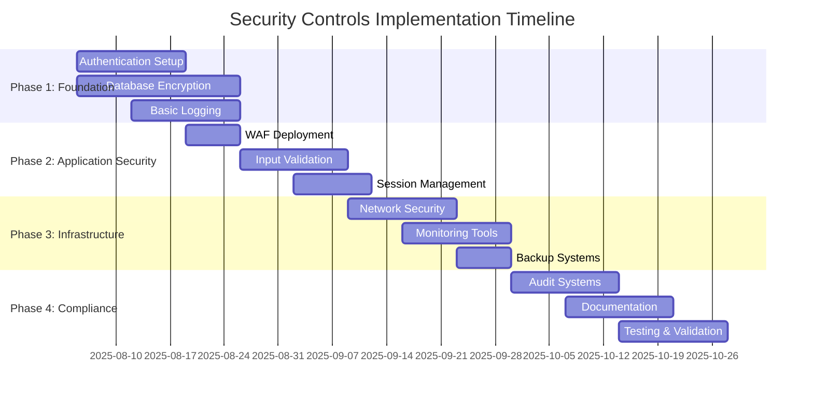

# Security Controls Implementation Plan
## Clinical Trial Data Collection Platform

**Document Version:** 1.0  
**Created:** August 4, 2025  
**Implementation Target:** November 2025  
**Classification:** CONFIDENTIAL - INTERNAL USE ONLY

---

## Executive Summary

This document provides a comprehensive implementation plan for security controls across the Clinical Trial Data Collection Platform. The plan ensures HIPAA compliance, OWASP Top 10 protection, and healthcare industry security best practices.

### Implementation Overview
- **Total Security Controls:** 47
- **Critical Controls:** 15
- **High Priority Controls:** 20
- **Medium Priority Controls:** 12
- **Estimated Timeline:** 11 weeks
- **Total Budget Estimate:** $75,000

---

## 1. Implementation Framework

### 1.1 Control Categories
- **Authentication and Access Control (AC)**
- **Data Protection and Encryption (DP)**
- **Network Security and Monitoring (NS)**
- **Application Security (AS)**
- **Audit and Compliance (AU)**
- **Incident Response (IR)**

### 1.2 Implementation Phases



---

## 2. Authentication and Access Control (AC)

### AC-001: AWS Cognito User Pool Configuration
**Priority:** CRITICAL  
**Timeline:** Week 1-2  
**Owner:** Development Team  
**Budget:** $0 (AWS Free Tier)

#### Implementation Details
```yaml
# Terraform Configuration
resource "aws_cognito_user_pool" "clinical_trial_users" {
  name = "clinical-trial-user-pool"
  
  # Password Policy
  password_policy {
    minimum_length    = 12
    require_lowercase = true
    require_numbers   = true
    require_symbols   = true
    require_uppercase = true
  }
  
  # MFA Configuration
  mfa_configuration = "ON"
  
  # Account Recovery
  account_recovery_setting {
    recovery_mechanism {
      name     = "verified_email"
      priority = 1
    }
    recovery_mechanism {
      name     = "verified_phone_number"
      priority = 2
    }
  }
  
  # Security Features
  user_pool_add_ons {
    advanced_security_mode = "ENFORCED"
  }
  
  # Device Configuration
  device_configuration {
    challenge_required_on_new_device      = true
    device_only_remembered_on_user_prompt = true
  }
  
  tags = {
    Environment = "production"
    Compliance  = "HIPAA"
  }
}

# User Pool Client
resource "aws_cognito_user_pool_client" "clinical_trial_app" {
  name         = "clinical-trial-app"
  user_pool_id = aws_cognito_user_pool.clinical_trial_users.id
  
  # Token Validity
  access_token_validity  = 1  # 1 hour
  id_token_validity     = 1  # 1 hour
  refresh_token_validity = 1  # 1 day
  
  # Auth Flows
  explicit_auth_flows = [
    "ALLOW_USER_SRP_AUTH",
    "ALLOW_USER_PASSWORD_AUTH",
    "ALLOW_REFRESH_TOKEN_AUTH"
  ]
  
  # Security
  prevent_user_existence_errors = "ENABLED"
  
  # OAuth Settings
  supported_identity_providers = ["COGNITO", "Google"]
  
  callback_urls = [
    "https://clinical-trial.example.com/auth/callback"
  ]
  
  logout_urls = [
    "https://clinical-trial.example.com/auth/logout"
  ]
}
```

#### Success Criteria
- [ ] MFA enforcement for all users
- [ ] Session timeout after 15 minutes
- [ ] Strong password policy enforcement
- [ ] Account lockout after 5 failed attempts
- [ ] Integration with Google OAuth

### AC-002: Role-Based Access Control (RBAC)
**Priority:** CRITICAL  
**Timeline:** Week 2-3  
**Owner:** Security Team  
**Budget:** $2,000

#### Role Definitions
```yaml
# Clinical Trial Roles
roles:
  study_coordinator:
    permissions:
      - read:patients
      - create:questionnaires
      - update:study_protocols
      - view:audit_logs
    
  principal_investigator:
    permissions:
      - read:all_study_data
      - approve:protocol_changes
      - export:study_results
      - manage:study_team
    
  clinical_research_associate:
    permissions:
      - read:assigned_studies
      - update:patient_data
      - create:adverse_events
      - view:compliance_reports
    
  data_manager:
    permissions:
      - read:clinical_data
      - validate:data_quality
      - export:study_datasets
      - manage:data_dictionaries
    
  patient:
    permissions:
      - read:own_data
      - update:questionnaire_responses
      - view:study_information
      - manage:consent_preferences
```

#### Implementation Code
```typescript
// RBAC Middleware
export class RBACMiddleware {
  private permissions: Map<string, string[]> = new Map();
  
  constructor() {
    this.loadPermissions();
  }
  
  hasPermission(userRole: string, action: string, resource: string): boolean {
    const userPermissions = this.permissions.get(userRole) || [];
    const requiredPermission = `${action}:${resource}`;
    
    return userPermissions.includes(requiredPermission) || 
           userPermissions.includes(`${action}:*`) ||
           userPermissions.includes(`*:${resource}`);
  }
  
  authorize(requiredPermission: string) {
    return (req: Request, res: Response, next: NextFunction) => {
      const userRole = req.user?.role;
      const [action, resource] = requiredPermission.split(':');
      
      if (!this.hasPermission(userRole, action, resource)) {
        return res.status(403).json({
          error: 'Insufficient permissions',
          code: 'FORBIDDEN'
        });
      }
      
      next();
    };
  }
}
```

### AC-003: Session Management
**Priority:** HIGH  
**Timeline:** Week 3  
**Owner:** Development Team  
**Budget:** $500

#### Implementation
```typescript
// Secure Session Configuration
export const sessionConfig = {
  cookie: {
    secure: true,           // HTTPS only
    httpOnly: true,         // No client-side access
    maxAge: 15 * 60 * 1000, // 15 minutes
    sameSite: 'strict'      // CSRF protection
  },
  
  // Session timeout handling
  rolling: true,            // Reset timeout on activity
  resave: false,
  saveUninitialized: false,
  
  // Secure session store
  store: new RedisStore({
    client: redisClient,
    ttl: 900 // 15 minutes
  })
};

// Automatic logout implementation
export class SessionManager {
  static setupAutomaticLogout(app: Express) {
    app.use((req, res, next) => {
      if (req.session?.lastActivity) {
        const timeSinceLastActivity = Date.now() - req.session.lastActivity;
        
        if (timeSinceLastActivity > 15 * 60 * 1000) {
          req.session.destroy((err) => {
            if (err) console.error('Session destruction error:', err);
          });
          
          return res.status(401).json({
            error: 'Session expired',
            code: 'SESSION_TIMEOUT'
          });
        }
      }
      
      if (req.session) {
        req.session.lastActivity = Date.now();
      }
      
      next();
    });
  }
}
```

---

## 3. Data Protection and Encryption (DP)

### DP-001: Database Encryption at Rest
**Priority:** CRITICAL  
**Timeline:** Week 1-3  
**Owner:** Infrastructure Team  
**Budget:** $3,000

#### Aurora PostgreSQL Encryption
```hcl
# Terraform Configuration
resource "aws_rds_cluster" "clinical_trial_db" {
  cluster_identifier      = "clinical-trial-cluster"
  engine                 = "aurora-postgresql"
  engine_version         = "15.4"
  database_name          = "clinical_trials"
  master_username        = "postgres"
  
  # Encryption Configuration
  storage_encrypted = true
  kms_key_id       = aws_kms_key.rds_encryption_key.arn
  
  # Security Groups
  vpc_security_group_ids = [aws_security_group.rds_security_group.id]
  db_subnet_group_name   = aws_db_subnet_group.clinical_trial_subnets.name
  
  # Backup Configuration
  backup_retention_period = 35  # 5 weeks for HIPAA
  preferred_backup_window = "03:00-04:00"
  
  # Performance Insights
  enabled_cloudwatch_logs_exports = ["postgresql"]
  
  tags = {
    Environment = "production"
    Compliance  = "HIPAA"
  }
}

# KMS Key for Database Encryption
resource "aws_kms_key" "rds_encryption_key" {
  description             = "RDS encryption key for clinical trial database"
  deletion_window_in_days = 30
  
  policy = jsonencode({
    Version = "2012-10-17"
    Statement = [
      {
        Effect = "Allow"
        Principal = {
          AWS = "arn:aws:iam::${data.aws_caller_identity.current.account_id}:root"
        }
        Action   = "kms:*"
        Resource = "*"
      }
    ]
  })
  
  tags = {
    Name = "clinical-trial-rds-key"
    Environment = "production"
  }
}
```

#### Column-Level Encryption with pgcrypto
```sql
-- Enable pgcrypto extension
CREATE EXTENSION IF NOT EXISTS pgcrypto;

-- Create encryption functions
CREATE OR REPLACE FUNCTION encrypt_pii(data TEXT)
RETURNS BYTEA AS $$
BEGIN
  RETURN pgp_sym_encrypt(data, current_setting('clinical_trial.encryption_key'));
END;
$$ LANGUAGE plpgsql SECURITY DEFINER;

CREATE OR REPLACE FUNCTION decrypt_pii(encrypted_data BYTEA)
RETURNS TEXT AS $$
BEGIN
  RETURN pgp_sym_decrypt(encrypted_data, current_setting('clinical_trial.encryption_key'));
END;
$$ LANGUAGE plpgsql SECURITY DEFINER;

-- Patient table with encrypted PHI
CREATE TABLE patients (
    id UUID PRIMARY KEY DEFAULT gen_random_uuid(),
    
    -- Encrypted PHI fields
    first_name BYTEA NOT NULL,
    last_name BYTEA NOT NULL,
    date_of_birth BYTEA NOT NULL,
    ssn BYTEA NOT NULL,
    phone_number BYTEA,
    email BYTEA,
    
    -- Non-encrypted fields
    patient_number VARCHAR(20) UNIQUE NOT NULL,
    study_id UUID NOT NULL,
    enrollment_date TIMESTAMP DEFAULT NOW(),
    
    -- Audit fields
    created_at TIMESTAMP DEFAULT NOW(),
    created_by UUID NOT NULL,
    updated_at TIMESTAMP DEFAULT NOW(),
    updated_by UUID NOT NULL,
    
    FOREIGN KEY (study_id) REFERENCES studies(id),
    FOREIGN KEY (created_by) REFERENCES users(id),
    FOREIGN KEY (updated_by) REFERENCES users(id)
);

-- Row-level security
ALTER TABLE patients ENABLE ROW LEVEL SECURITY;

-- Policy for data access
CREATE POLICY patient_access_policy ON patients
    FOR ALL TO clinical_users
    USING (has_patient_access(current_user_id(), id));
```

### DP-002: S3 Bucket Encryption and Policies
**Priority:** HIGH  
**Timeline:** Week 2  
**Owner:** Infrastructure Team  
**Budget:** $1,000

#### S3 Configuration
```hcl
# S3 Bucket for Clinical Documents
resource "aws_s3_bucket" "clinical_documents" {
  bucket = "clinical-trial-documents-${random_string.bucket_suffix.result}"
  
  tags = {
    Environment = "production"
    Compliance  = "HIPAA"
  }
}

# Server-side encryption
resource "aws_s3_bucket_server_side_encryption_configuration" "clinical_documents_encryption" {
  bucket = aws_s3_bucket.clinical_documents.id
  
  rule {
    apply_server_side_encryption_by_default {
      kms_master_key_id = aws_kms_key.s3_encryption_key.arn
      sse_algorithm     = "aws:kms"
    }
    bucket_key_enabled = true
  }
}

# Public access block
resource "aws_s3_bucket_public_access_block" "clinical_documents_pab" {
  bucket = aws_s3_bucket.clinical_documents.id
  
  block_public_acls       = true
  block_public_policy     = true
  ignore_public_acls      = true
  restrict_public_buckets = true
}

# Bucket policy
resource "aws_s3_bucket_policy" "clinical_documents_policy" {
  bucket = aws_s3_bucket.clinical_documents.id
  
  policy = jsonencode({
    Version = "2012-10-17"
    Statement = [
      {
        Effect = "Deny"
        Principal = "*"
        Action = "s3:*"
        Resource = [
          aws_s3_bucket.clinical_documents.arn,
          "${aws_s3_bucket.clinical_documents.arn}/*"
        ]
        Condition = {
          StringNotEquals = {
            "s3:x-amz-server-side-encryption" = "aws:kms"
          }
        }
      }
    ]
  })
}

# Lifecycle configuration for cost optimization
resource "aws_s3_bucket_lifecycle_configuration" "clinical_documents_lifecycle" {
  bucket = aws_s3_bucket.clinical_documents.id
  
  rule {
    id     = "clinical_documents_lifecycle"
    status = "Enabled"
    
    transition {
      days          = 90
      storage_class = "STANDARD_IA"
    }
    
    transition {
      days          = 365
      storage_class = "GLACIER"
    }
    
    transition {
      days          = 2555  # 7 years
      storage_class = "DEEP_ARCHIVE"
    }
  }
}
```

### DP-003: Data in Transit Encryption
**Priority:** CRITICAL  
**Timeline:** Week 2  
**Owner:** Infrastructure Team  
**Budget:** $500

#### TLS Configuration
```hcl
# Application Load Balancer with SSL
resource "aws_lb" "clinical_trial_alb" {
  name               = "clinical-trial-alb"
  internal           = false
  load_balancer_type = "application"
  security_groups    = [aws_security_group.alb_security_group.id]
  subnets           = aws_subnet.public[*].id
  
  enable_deletion_protection = true
  
  tags = {
    Environment = "production"
  }
}

# HTTPS Listener with TLS 1.3
resource "aws_lb_listener" "clinical_trial_https" {
  load_balancer_arn = aws_lb.clinical_trial_alb.arn
  port              = "443"
  protocol          = "HTTPS"
  ssl_policy        = "ELBSecurityPolicy-TLS13-1-2-2021-06"
  certificate_arn   = aws_acm_certificate.clinical_trial_cert.arn
  
  default_action {
    type             = "forward"
    target_group_arn = aws_lb_target_group.clinical_trial_api.arn
  }
}

# HTTP to HTTPS redirect
resource "aws_lb_listener" "clinical_trial_http_redirect" {
  load_balancer_arn = aws_lb.clinical_trial_alb.arn
  port              = "80"
  protocol          = "HTTP"
  
  default_action {
    type = "redirect"
    
    redirect {
      port        = "443"
      protocol    = "HTTPS"
      status_code = "HTTP_301"
    }
  }
}
```

---

## 4. Network Security and Monitoring (NS)

### NS-001: AWS WAF Implementation
**Priority:** CRITICAL  
**Timeline:** Week 3  
**Owner:** Infrastructure Team  
**Budget:** $2,000/month

#### WAF Configuration
```hcl
# Web Application Firewall
resource "aws_wafv2_web_acl" "clinical_trial_waf" {
  name  = "clinical-trial-waf"
  scope = "CLOUDFRONT"
  
  default_action {
    allow {}
  }
  
  # OWASP Top 10 Core Rule Set
  rule {
    name     = "AWSManagedRulesCommonRuleSet"
    priority = 1
    
    override_action {
      none {}
    }
    
    statement {
      managed_rule_group_statement {
        name        = "AWSManagedRulesCommonRuleSet"
        vendor_name = "AWS"
        
        # Exclude rules that might cause false positives
        excluded_rule {
          name = "SizeRestrictions_BODY"
        }
      }
    }
    
    visibility_config {
      cloudwatch_metrics_enabled = true
      metric_name                = "CommonRuleSetMetric"
      sampled_requests_enabled   = true
    }
  }
  
  # Known Bad Inputs Rule Set
  rule {
    name     = "AWSManagedRulesKnownBadInputsRuleSet"
    priority = 2
    
    override_action {
      none {}
    }
    
    statement {
      managed_rule_group_statement {
        name        = "AWSManagedRulesKnownBadInputsRuleSet"
        vendor_name = "AWS"
      }
    }
    
    visibility_config {
      cloudwatch_metrics_enabled = true
      metric_name                = "KnownBadInputsRuleSetMetric"
      sampled_requests_enabled   = true
    }
  }
  
  # SQL Injection Rule Set
  rule {
    name     = "AWSManagedRulesSQLiRuleSet"
    priority = 3
    
    override_action {
      none {}
    }
    
    statement {
      managed_rule_group_statement {
        name        = "AWSManagedRulesSQLiRuleSet"
        vendor_name = "AWS"
      }
    }
    
    visibility_config {
      cloudwatch_metrics_enabled = true
      metric_name                = "SQLiRuleSetMetric"
      sampled_requests_enabled   = true
    }
  }
  
  # Rate Limiting Rule
  rule {
    name     = "RateLimitRule"
    priority = 4
    
    action {
      block {}
    }
    
    statement {
      rate_based_statement {
        limit              = 2000
        aggregate_key_type = "IP"
      }
    }
    
    visibility_config {
      cloudwatch_metrics_enabled = true
      metric_name                = "RateLimitRuleMetric"
      sampled_requests_enabled   = true
    }
  }
  
  tags = {
    Environment = "production"
    Compliance  = "HIPAA"
  }
}
```

### NS-002: VPC Security Configuration
**Priority:** HIGH  
**Timeline:** Week 2  
**Owner:** Infrastructure Team  
**Budget:** $1,500

#### Network Architecture
```hcl
# VPC Configuration
resource "aws_vpc" "clinical_trial_vpc" {
  cidr_block           = "10.0.0.0/16"
  enable_dns_hostnames = true
  enable_dns_support   = true
  
  tags = {
    Name = "clinical-trial-vpc"
    Environment = "production"
  }
}

# Private Subnets for Database
resource "aws_subnet" "private_database" {
  count             = 2
  vpc_id            = aws_vpc.clinical_trial_vpc.id
  cidr_block        = "10.0.${count.index + 1}.0/24"
  availability_zone = data.aws_availability_zones.available.names[count.index]
  
  tags = {
    Name = "clinical-trial-private-db-${count.index + 1}"
    Type = "Private Database"
  }
}

# Private Subnets for Lambda
resource "aws_subnet" "private_lambda" {
  count             = 2
  vpc_id            = aws_vpc.clinical_trial_vpc.id
  cidr_block        = "10.0.${count.index + 10}.0/24"
  availability_zone = data.aws_availability_zones.available.names[count.index]
  
  tags = {
    Name = "clinical-trial-private-lambda-${count.index + 1}"
    Type = "Private Lambda"
  }
}

# Public Subnets for Load Balancer
resource "aws_subnet" "public" {
  count                   = 2
  vpc_id                  = aws_vpc.clinical_trial_vpc.id
  cidr_block              = "10.0.${count.index + 20}.0/24"
  availability_zone       = data.aws_availability_zones.available.names[count.index]
  map_public_ip_on_launch = true
  
  tags = {
    Name = "clinical-trial-public-${count.index + 1}"
    Type = "Public"
  }
}

# Security Groups
resource "aws_security_group" "rds_security_group" {
  name_prefix = "clinical-trial-rds-"
  vpc_id      = aws_vpc.clinical_trial_vpc.id
  
  ingress {
    from_port       = 5432
    to_port         = 5432
    protocol        = "tcp"
    security_groups = [aws_security_group.lambda_security_group.id]
  }
  
  egress {
    from_port   = 0
    to_port     = 0
    protocol    = "-1"
    cidr_blocks = ["0.0.0.0/0"]
  }
  
  tags = {
    Name = "clinical-trial-rds-sg"
  }
}

resource "aws_security_group" "lambda_security_group" {
  name_prefix = "clinical-trial-lambda-"
  vpc_id      = aws_vpc.clinical_trial_vpc.id
  
  egress {
    from_port   = 0
    to_port     = 0
    protocol    = "-1"
    cidr_blocks = ["0.0.0.0/0"]
  }
  
  tags = {
    Name = "clinical-trial-lambda-sg"
  }
}
```

### NS-003: Network Monitoring and Flow Logs
**Priority:** MEDIUM  
**Timeline:** Week 4  
**Owner:** Infrastructure Team  
**Budget:** $800/month

#### VPC Flow Logs Configuration
```hcl
# VPC Flow Logs
resource "aws_flow_log" "clinical_trial_vpc_flow_log" {
  iam_role_arn    = aws_iam_role.flow_log_role.arn
  log_destination = aws_cloudwatch_log_group.vpc_flow_log.arn
  traffic_type    = "ALL"
  vpc_id          = aws_vpc.clinical_trial_vpc.id
  
  tags = {
    Name = "clinical-trial-vpc-flow-log"
  }
}

# CloudWatch Log Group for Flow Logs
resource "aws_cloudwatch_log_group" "vpc_flow_log" {
  name              = "/aws/vpc/clinical-trial-flowlogs"
  retention_in_days = 90
  
  tags = {
    Environment = "production"
    Purpose     = "SecurityMonitoring"
  }
}
```

---

## 5. Application Security (AS)

### AS-001: Input Validation and Sanitization
**Priority:** HIGH  
**Timeline:** Week 4-5  
**Owner:** Development Team  
**Budget:** $3,000

#### Input Validation Framework
```typescript
// Input validation schema using Joi
import Joi from 'joi';

export const PatientDataSchema = Joi.object({
  firstName: Joi.string()
    .pattern(/^[A-Za-z\s\-'\.]{1,50}$/)
    .required()
    .messages({
      'string.pattern.base': 'First name contains invalid characters',
      'any.required': 'First name is required'
    }),
    
  lastName: Joi.string()
    .pattern(/^[A-Za-z\s\-'\.]{1,50}$/)
    .required(),
    
  dateOfBirth: Joi.date()
    .iso()
    .max('now')
    .required(),
    
  email: Joi.string()
    .email({ tlds: { allow: false } })
    .max(254)
    .optional(),
    
  phoneNumber: Joi.string()
    .pattern(/^\+?[\d\s\-\(\)\.]{10,15}$/)
    .optional(),
    
  medicalRecordNumber: Joi.string()
    .alphanum()
    .min(5)
    .max(20)
    .required()
});

// SQL Injection Prevention
export class DatabaseQuery {
  static async executeQuery(query: string, params: any[]) {
    // Use parameterized queries only
    const client = await pool.connect();
    try {
      const result = await client.query(query, params);
      return result.rows;
    } finally {
      client.release();
    }
  }
  
  // Example safe query method
  static async getPatientById(patientId: string) {
    const query = `
      SELECT 
        id,
        decrypt_pii(first_name) as first_name,
        decrypt_pii(last_name) as last_name,
        patient_number,
        study_id
      FROM patients 
      WHERE id = $1 AND has_patient_access(current_user_id(), id)
    `;
    
    return this.executeQuery(query, [patientId]);
  }
}

// XSS Prevention
export const sanitizeOutput = (data: any): any => {
  if (typeof data === 'string') {
    return data
      .replace(/&/g, '&amp;')
      .replace(/</g, '&lt;')
      .replace(/>/g, '&gt;')
      .replace(/"/g, '&quot;')
      .replace(/'/g, '&#x27;');
  }
  
  if (Array.isArray(data)) {
    return data.map(sanitizeOutput);
  }
  
  if (typeof data === 'object' && data !== null) {
    const sanitized: any = {};
    for (const [key, value] of Object.entries(data)) {
      sanitized[key] = sanitizeOutput(value);
    }
    return sanitized;
  }
  
  return data;
};
```

### AS-002: Secure Headers Implementation
**Priority:** MEDIUM  
**Timeline:** Week 3  
**Owner:** Development Team  
**Budget:** $500

#### Security Headers Configuration
```typescript
// Security Headers Middleware
import helmet from 'helmet';

export const securityHeaders = helmet({
  // Content Security Policy
  contentSecurityPolicy: {
    directives: {
      defaultSrc: ["'self'"],
      styleSrc: ["'self'", "'unsafe-inline'", "https://fonts.googleapis.com"],
      fontSrc: ["'self'", "https://fonts.gstatic.com"],
      scriptSrc: ["'self'"],
      imgSrc: ["'self'", "data:", "https:"],
      connectSrc: ["'self'"],
      frameSrc: ["'none'"],
      objectSrc: ["'none'"],
      baseUri: ["'self'"],
      formAction: ["'self'"],
      upgradeInsecureRequests: []
    }
  },
  
  // HTTP Strict Transport Security
  hsts: {
    maxAge: 31536000,
    includeSubDomains: true,
    preload: true
  },
  
  // X-Frame-Options
  frameguard: {
    action: 'deny'
  },
  
  // X-Content-Type-Options
  noSniff: true,
  
  // X-XSS-Protection
  xssFilter: true,
  
  // Referrer Policy
  referrerPolicy: {
    policy: 'strict-origin-when-cross-origin'
  },
  
  // Permissions Policy
  permittedCrossDomainPolicies: false
});

// Additional custom headers
export const customSecurityHeaders = (req: Request, res: Response, next: NextFunction) => {
  // Remove server information
  res.removeHeader('X-Powered-By');
  
  // Set custom security headers
  res.setHeader('X-Request-ID', req.headers['x-request-id'] || 'unknown');
  res.setHeader('X-Content-Type-Options', 'nosniff');
  res.setHeader('X-DNS-Prefetch-Control', 'off');
  res.setHeader('X-Download-Options', 'noopen');
  res.setHeader('X-Permitted-Cross-Domain-Policies', 'none');
  
  next();
};
```

---

## 6. Audit and Compliance (AU)

### AU-001: Comprehensive Audit Logging
**Priority:** CRITICAL  
**Timeline:** Week 2-4  
**Owner:** Development + Infrastructure Team  
**Budget:** $2,500

#### CloudTrail Configuration
```hcl
# CloudTrail for API Auditing
resource "aws_cloudtrail" "clinical_trial_audit" {
  name                         = "clinical-trial-audit-trail"
  s3_bucket_name              = aws_s3_bucket.audit_logs.bucket
  include_global_service_events = true
  is_multi_region_trail       = true
  enable_logging              = true
  
  # Data Events
  event_selector {
    read_write_type                 = "All"
    include_management_events       = true
    
    data_resource {
      type   = "AWS::S3::Object"
      values = ["${aws_s3_bucket.clinical_documents.arn}/*"]
    }
    
    data_resource {
      type   = "AWS::Lambda::Function"
      values = ["arn:aws:lambda:*:*:function:clinical-trial-*"]
    }
  }
  
  # CloudWatch Logs Integration
  cloud_watch_logs_group_arn = "${aws_cloudwatch_log_group.cloudtrail.arn}:*"
  cloud_watch_logs_role_arn  = aws_iam_role.cloudtrail_logs_role.arn
  
  tags = {
    Environment = "production"
    Purpose     = "Audit"
  }
}
```

#### Application Audit Logging
```typescript
// Audit Log Interface
export interface AuditEvent {
  timestamp: Date;
  userId: string;
  userRole: string;
  action: string;
  resource: string;
  resourceId: string;
  ipAddress: string;
  userAgent: string;
  success: boolean;
  details?: any;
  requestId: string;
}

// Audit Logger Class
export class AuditLogger {
  private static instance: AuditLogger;
  
  static getInstance(): AuditLogger {
    if (!this.instance) {
      this.instance = new AuditLogger();
    }
    return this.instance;
  }
  
  async logEvent(event: AuditEvent): Promise<void> {
    // Log to database
    await this.logToDatabase(event);
    
    // Log to CloudWatch
    await this.logToCloudWatch(event);
    
    // Log to file for local processing
    await this.logToFile(event);
  }
  
  private async logToDatabase(event: AuditEvent): Promise<void> {
    const query = `
      INSERT INTO audit_logs (
        timestamp, user_id, user_role, action, resource, 
        resource_id, ip_address, user_agent, success, 
        details, request_id
      ) VALUES ($1, $2, $3, $4, $5, $6, $7, $8, $9, $10, $11)
    `;
    
    await DatabaseQuery.executeQuery(query, [
      event.timestamp,
      event.userId,
      event.userRole,
      event.action,
      event.resource,
      event.resourceId,
      event.ipAddress,
      event.userAgent,
      event.success,
      JSON.stringify(event.details),
      event.requestId
    ]);
  }
  
  // HIPAA-specific audit events
  static auditPHIAccess(req: Request, resourceId: string, action: string) {
    const auditEvent: AuditEvent = {
      timestamp: new Date(),
      userId: req.user?.id || 'anonymous',
      userRole: req.user?.role || 'unknown',
      action: `PHI_${action.toUpperCase()}`,
      resource: 'patient_data',
      resourceId,
      ipAddress: req.ip,
      userAgent: req.get('User-Agent') || 'unknown',
      success: true,
      requestId: req.get('x-request-id') || 'unknown'
    };
    
    AuditLogger.getInstance().logEvent(auditEvent);
  }
}
```

---

## 7. Implementation Timeline and Milestones

### Week 1-2: Foundation Security Controls
- [ ] AWS Cognito User Pool setup with MFA
- [ ] Database encryption at rest configuration
- [ ] Basic audit logging implementation
- [ ] TLS 1.3 configuration for all endpoints

**Milestone:** Authentication and encryption foundation complete

### Week 3-4: Application Security
- [ ] AWS WAF deployment with OWASP rules
- [ ] Input validation framework implementation
- [ ] Session management and timeout controls
- [ ] Security headers implementation

**Milestone:** Application-level security controls operational

### Week 5-6: Network and Infrastructure Security
- [ ] VPC security groups configuration
- [ ] Network monitoring and flow logs
- [ ] S3 bucket policies and lifecycle management
- [ ] IAM roles and policies optimization

**Milestone:** Infrastructure security hardening complete

### Week 7-8: Advanced Security Controls
- [ ] Column-level encryption implementation
- [ ] Role-based access control deployment
- [ ] Comprehensive audit logging system
- [ ] Security monitoring and alerting

**Milestone:** Advanced security controls operational

### Week 9-10: Testing and Validation
- [ ] Penetration testing execution
- [ ] HIPAA compliance validation
- [ ] Security control effectiveness testing
- [ ] Vulnerability assessment and remediation

**Milestone:** Security validation and testing complete

### Week 11: Go-Live Preparation
- [ ] Final security review and approval
- [ ] Security runbook documentation
- [ ] Incident response procedures testing
- [ ] Security team training and handover

**Milestone:** Production-ready security posture achieved

---

## 8. Budget and Resource Allocation

### 8.1 Infrastructure Costs (Monthly)
- **AWS WAF:** $2,000
- **KMS Keys:** $100
- **CloudTrail:** $500
- **VPC Flow Logs:** $800
- **CloudWatch Logs:** $300
- **S3 Storage (Audit Logs):** $200

**Total Monthly Infrastructure:** $3,900

### 8.2 Implementation Costs (One-time)
- **Security Consulting:** $15,000
- **Development Resources:** $25,000
- **Testing and Validation:** $10,000
- **Training and Documentation:** $5,000
- **Tools and Licenses:** $3,000

**Total Implementation Cost:** $58,000

### 8.3 Ongoing Operational Costs (Annual)
- **Security Monitoring Tools:** $12,000
- **Compliance Audits:** $15,000
- **Security Training:** $5,000
- **Incident Response:** $8,000

**Total Annual Operational:** $40,000

---

## 9. Success Metrics and KPIs

### 9.1 Security Metrics
- **Security Incidents:** 0 critical incidents
- **Vulnerability Response Time:** < 24 hours for critical
- **Access Review Completion:** 100% quarterly
- **Security Training Completion:** 100% annually
- **Audit Finding Resolution:** 100% within SLA

### 9.2 Compliance Metrics
- **HIPAA Compliance Score:** 100%
- **Penetration Test Results:** No critical findings
- **Data Breach Incidents:** 0
- **Regulatory Audit Results:** Pass with no findings
- **Privacy Impact Assessment:** Complete and current

### 9.3 Technical Metrics
- **WAF Block Rate:** > 99% of malicious requests blocked
- **Authentication Success Rate:** > 99.9%
- **Session Timeout Compliance:** 100%
- **Encryption Coverage:** 100% of PHI encrypted
- **Audit Log Completeness:** 100% of required events logged

---

## 10. Risk Management and Contingency Plans

### 10.1 Implementation Risks
- **Resource Availability:** Cross-train team members
- **Technical Complexity:** Engage external consultants
- **Timeline Delays:** Prioritize critical controls first
- **Budget Overruns:** Implement controls in phases

### 10.2 Operational Risks
- **False Positives:** Fine-tune WAF rules gradually
- **Performance Impact:** Load test all security controls
- **User Experience:** Conduct user acceptance testing
- **Compliance Gaps:** Regular compliance assessments

---

## Document Approval and Sign-off

**Implementation Team:**
- [ ] Chief Information Security Officer
- [ ] Lead Security Architect  
- [ ] Infrastructure Security Engineer
- [ ] Application Security Engineer
- [ ] Development Team Lead
- [ ] Quality Assurance Manager

**Final Approval:**
- [ ] Chief Technology Officer
- [ ] Chief Privacy Officer
- [ ] Chief Compliance Officer

**Implementation Authorization Date:** _______________

---

**CONFIDENTIAL - INTERNAL USE ONLY**  
This document contains sensitive security implementation details and should be handled according to data classification policies.